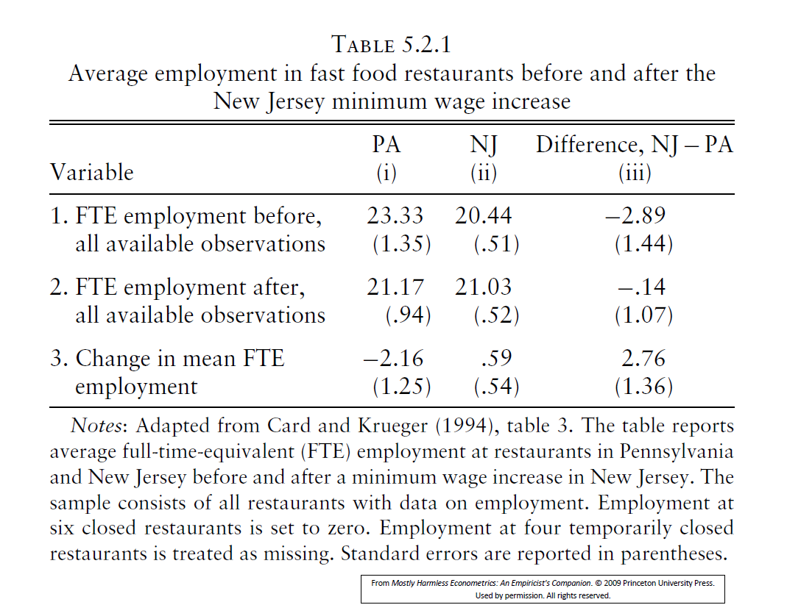
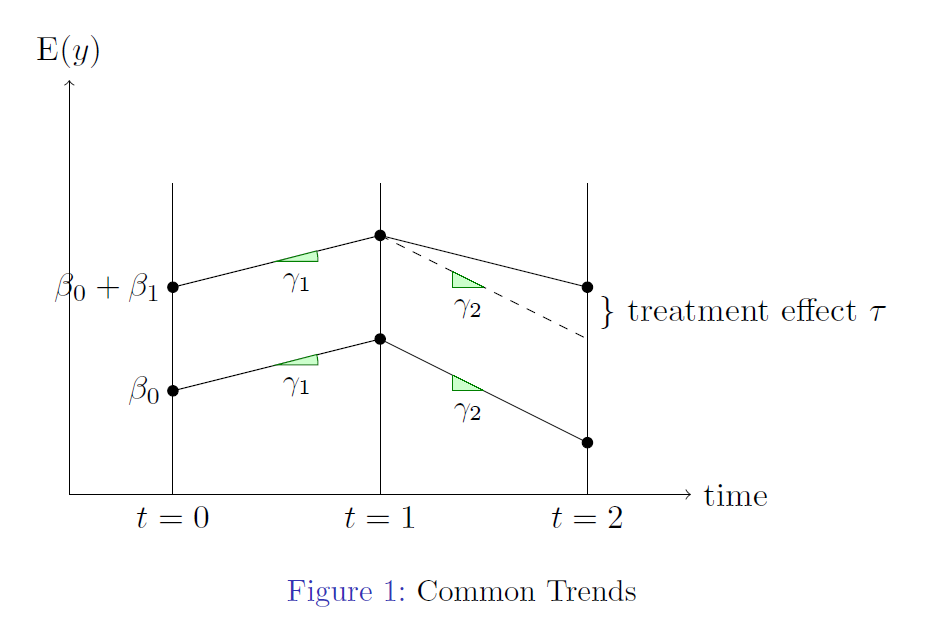
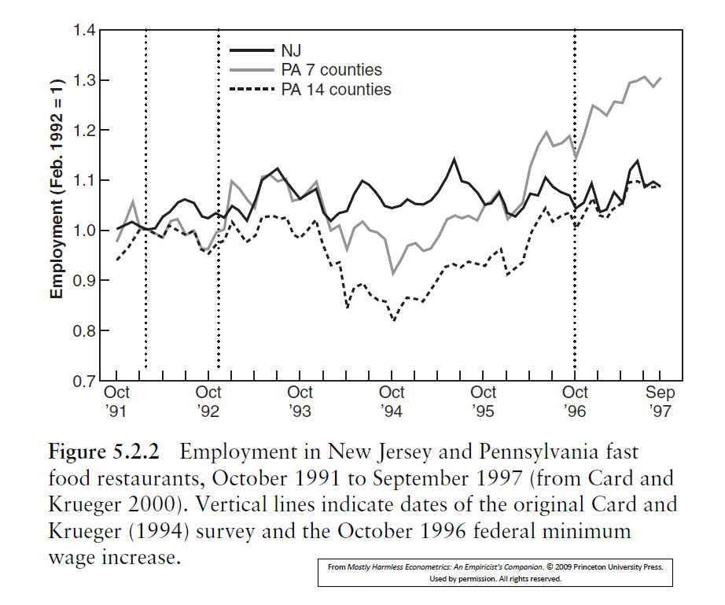
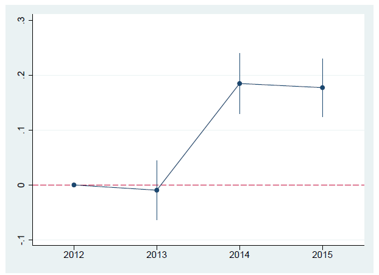

```{r setup, include=FALSE}
knitr::opts_chunk$set(echo = FALSE, message=FALSE, warning = FALSE)
```


## Policy analysis, examples

- Evaluating micro-economic policies is one of the most important uses of micro-econometrics.
- Typical examples of policy evaluations are:
- The effects of class-sizes on school achievement
- The effects of job-training programs on subsequent labour market outcomes
- The effects of the Education Maintenance Allowance on subsequent participation in education
- The effects of tobacco taxes and smoking bans on smoking and cigarette consumption. Ditto sugar tax on fizzy drinks.
- The effects of gun control laws on deaths by firearms in the US.
- The effects of introducing of a minimum wage on employment of low paid workers in the UK. And in certain states in the US.


## Policy analysis, roadmap

- Typically there is a treatment $w$ and a response $y$.
- If $w$ is a dummy (eg a training program) then it looks as if a standard regression of $y$ on $w$ plus controls might deliver what the policy-maker is after IF $w$ is exogenous.
- This is what happens naturally in a Randomised Control Trial (RCT).
- When we have panel data there are more options
- We start with panel data and use the set-up and results in Lecture 6.

## Policy analysis with two-period panel data

- Define $w_{i t}$ as a dummy variable for whether and when an individual undertook the program/received the treatment.

\begin{tabular}{lllllll|llll}
 $i$ & $t$ & $y_{i t}$ & $w_{i t}$ & $D_{t}^{2}$ & ( $T_{i}$ ) & $\mathbf{x}_{i t}$ & $\Delta y_{i}$ & $\Delta w_{i}$ & $\Delta D_{t}^{2}$ & $\Delta \mathrm{x}_{i}$ \\ \hline\hline
1 & 1 & $y_{11}$ & 0 & 0 & (0) & $\mathrm{x}_{11}$ & . & . & . & \\ 
1 & 2 & $y_{12}$ & 0 & 1 & (0) & $\mathrm{x}_{12}$ & $\Delta y_{1}$ & 0 & 1 & $\Delta \mathrm{x}_{1}$ \\ \hline 
2 & 1 & $y_{21}$ & 0 & 0 & (1) & $\mathrm{x}_{21}$ & & - & - & \\
2 & 2 & $y_{22}$ & 1 & 1 & (1) & $\mathrm{x}_{22}$ & $\Delta y_{2}$ & 1 & 1 & $\Delta \mathrm{x}_{2}$ \\ \hline
. & . & . & . & . & . & . & . & . & . & . \\ \hline
$N$ & 1 & $y_{N 1}$ & 0 & 0 & (1) & $\mathrm{x}_{N 1}$ & & & & \\
$N$ & 2 & $y_{N 2}$ & 1 & 1 & (1) & $\mathbf{x}_{N 2}$ & $\Delta y_{N}$ & 1 & 1 & $\Delta \mathbf{x}_{N}$ \\ \hline \hline
\end{tabular}

- Here there are only 2 patterns of treatment: $\{0,0\}$ or $\{0,1\}$

## Policy analysis with two-period panel data

- Abstracting from any covariates $x_{i t}$ 
- Estimate
$$
y_{i t}=\beta_{0}+\delta D_{t}^{2}+\tau w_{i t}+a_{i}+u_{i t}
$$
- If program participation takes place only in $t=2$, then $w_{i 1}=0$.
- To remove $a_{i}$, regress $\Delta y_{i}$ on $w_{i 2}$ and a constant:
$$
\Delta y_{i}=\delta+\tau w_{i 2}+\Delta u_{i t}
$$
where $\Delta w_{i}=w_{i 2}$ in period $t=2$.
- **Assuming** that all unobserved heterogeneity is in the **time-invariant** $a_i$ (beyond that $Cov(w_{it},u_{it})=0$) then $E(\tau)=\tau$ (unbiased).

## Policy analysis with two-period panel data

- Using our results from Lecture 3:

\begin{eqnarray*}
\widehat{\tau}&=&\overline{\Delta y}_{T}-\overline{\Delta y}_{C}\\
\widehat{\delta}&=&\overline{\Delta y}_{C}
\end{eqnarray*}

where $T$ denotes the treated group and $C$ denotes the control group. And...

- $\overline{\Delta y}_{T}$ is the sample average of the change in $y$ for the treated group;
- ditto $\overline{\Delta y}_{C}$ for the control group.

This simple estimator is specific to the two period panel.

## Policy analysis with two-period panel data

- $\widehat{\tau}$ is the difference-in-differences (DiD) estimator.
- Being panel data, it has the important advantage of being able to control for unobserved heterogeneity $a_{i}$. One can add (differenced) controls for any time-varying variables/covariates that might be correlated with program designation.
- However, it is important to stress that DiD does not require panel data; there is a version that uses pooled cross-sections...

## Policy analysis with pooled cross-sections

\begin{tabular}{lllllll}
$i$ & $t$ & $y_{i t}$ & $w_{i t}$ & $D_{t}^{2}$ & $T_{i t}$ & $\mathbf{x}_{i t}$ \\ \hline\hline 
1 & 1 & $y_{11}$ & 0 & 0 & 0 & $\mathrm{x}_{11}$ \\
2 & 1 & $y_{21}$ & 0 & 0 & 1 & $\mathrm{x}_{21}$ \\
 . & . & . & . & . & . & . \\ \hline
$N_{1}$ & 1 & $y_{N_{1}, 1}$ & 0 & 0 & 1 & $\mathbf{x}_{N_{1}, 1}$ \\
$N_{1}+1$ & 2 & . & 0 & 1 & 0 & . \\
$N_{1}+2$ & 2 & . & 0 & 1 & 0 & . \\
$N$ & 2 & $y_{N, 2}$ & 1 & 1 & 1 & $\mathbf{x}_{N, 2}$ \\ \hline\hline
\end{tabular}

- The variable $T_{i t}$ records whether the individual receives treatment, but in $t=1$ the treatment hasnt yet happened.
- Eg an individual who would be eligible for the minimum wage, but before the policy was introduced.

## In search for the counterfactual

Let us look at the earlier simple DiD estimator

\begin{equation*}
\hat{\tau}=\overline{\Delta y}_{T}-\overline{\Delta y}_{C}
\end{equation*}

We can re-write this as

\begin{eqnarray*}
\overline{\Delta y}_{T} - \overline{\Delta y}_{C} &=&(\bar{y}_{2,T} - \bar{y}_{1,T}) - (\bar{y}_{2,C} - \bar{y}_{1,C}) \\
&=& \bar{y}_{2,T} - \bar{y}_{1,T} - \bar{y}_{2,C} + \bar{y}_{1,C}\\
&=& (\bar{y}_{2,T} - \bar{y}_{1,T}) - (\bar{y}_{2,C} - \bar{y}_{1,C})\\
&=& (\bar{y}_{2,T} - \bar{y}_{2,C}) - (\bar{y}_{1,T} - \bar{y}_{1,C})
\end{eqnarray*}

- If we had a RCT, what would $(\bar{y}_{1,T} - \bar{y}_{1,C})$ be?
- If we do not have a RCT, what would $(\bar{y}_{1,T} - \bar{y}_{1,C})$ be?


## In search for the counterfactual

Now we look at the following version

\begin{equation*}
\overline{\Delta y}_{T} - \overline{\Delta y}_{C} = (\bar{y}_{2,T} - \bar{y}_{1,T}) - (\bar{y}_{2,C} - \bar{y}_{1,C})
\end{equation*}

- $(\bar{y}_{2,T} - \bar{y}_{1,T})$ is the change in the treatment group
- $(\bar{y}_{2,C} - \bar{y}_{1,C})$ is the **counterfactual** change

Some causal inference methods can be best understood by understanding the assumptions that allow to identify the counterfactual.

## DiD in a regression

Let's build towards a more general model. Consider:

$$y=\beta_{0}+\delta D+\beta_{1} T+\tau D . T+\text { controls }+u ~~~~(DID1)$$

where $D$ is a time dummy for after the treatment occurs, and $T$ is a dummy for whether ever-treated.

* The variable $w \equiv D . T$ is the product of 2 dummy variables; it is a so-called interaction.
* Now interpret the parameters without the controls. As always, we switch the 2 dummies on/off:

\begin{eqnarray*}
&& \mathrm{E}(y \mid D=0, T=0)=\beta_{0}+\mathrm{E}(u \mid D=0, T=0) \\
&& \mathrm{E}(y \mid D=0, T=1)=\beta_{0}+\beta_{1}+\mathrm{E}(u \mid D=0, T=1) \\
&& \mathrm{E}(y \mid D=1, T=0)=\beta_{0}+\delta+\mathrm{E}(u \mid D=1, T=0) \\
&& \mathrm{E}(y \mid D=1, T=1)=\beta_{0}+\delta+\beta_{1}+\tau+\mathrm{E}(u \mid D=1, T=1)
\end{eqnarray*}

## DiD in a regression

Next assume exogeneity

\begin{eqnarray*}
&& \mathrm{E}(u \mid D=0, T=0)=\mathrm{E}(u \mid D=0, T=1)= \\
&& \quad \mathrm{E}(u \mid D=1, T=0)=\mathrm{E}(u \mid D=1, T=1)=0 
\end{eqnarray*}

Then

\begin{eqnarray*}
& \mathrm{E}(y \mid D=0, T=0)=\beta_{0} \\
& \mathrm{E}(y \mid D=0, T=1)=\beta_{0}+\beta_{1} \\
& \mathrm{E}(y \mid D=1, T=0)=\beta_{0}+\delta \\
& \mathrm{E}(y \mid D=1, T=1)=\beta_{0}+\delta+\beta_{1}+\tau
\end{eqnarray*}

## DiD in a regression

Now solve for the 4 parameters:

\begin{eqnarray*}
\beta_{0} & =&\mathrm{E}(y \mid D=0, T=0) \\
\beta_{1} & =&\mathrm{E}(y \mid D=0, T=1)-\mathrm{E}(y \mid D=0, T=0) \\
\delta & =&\mathrm{E}(y \mid D=1, T=0)-\mathrm{E}(y \mid D=0, T=0)
\end{eqnarray*}

\begin{eqnarray*}
\tau&=&[\mathrm{E}(y \mid D=1, T=1)-\mathrm{E}(y \mid D=0, T=1)]- \\
&& {[\mathrm{E}(y \mid D=1, T=0)-\mathrm{E}(y \mid D=0, T=0)]} ~~~(DIDest)
\end{eqnarray*}

\begin{small}
- $\tau$ is the DiD estimator in the population. The sample analogue is $\left(\bar{y}_{2, T}-\bar{y}_{2, C}\right)-\left(\bar{y}_{1, T}-\bar{y}_{1, C}\right)$.
- $\delta$ and $\beta_{1}$ are "single" differences, or population differentials:
- $\delta$ is a macro effect, but only for the control group.
- $\beta_{1}$ is a treatment effect, but only before the policy was introduced.
\end{small}

## DiD in a regression

\begin{small}
\begin{itemize}
\item When estimated by OLS, $\widehat{\beta}_{0}, \widehat{\beta}_{1}, \widehat{\delta}$, and $\widehat{\tau}$ will replicate exactly the corresponding means.
\item Using a $\bar{y}_{s t}$ notation, where $i \in s=1$ are untreated individuals and $i \in s=2$ are treated individuals:
\end{itemize}

$$ \widehat{\beta}_{0}=\bar{y}_{11} \quad \widehat{\beta}_{1}=\bar{y}_{21}-\bar{y}_{11} \quad \widehat{\delta}=\bar{y}_{12}-\bar{y}_{11}$$
and
$$
\begin{aligned}
\widehat{\tau} & =\left(\bar{y}_{22}-\bar{y}_{21}\right)-\left(\bar{y}_{12}-\bar{y}_{11}\right) \\
& =\left(\bar{y}_{22}-\bar{y}_{12}\right)-\left(\bar{y}_{21}-\bar{y}_{11}\right) .
\end{aligned}
$$

So why bother? The regression form is very useful:


\begin{itemize}
\item Additional $x \mathrm{~s}$ can be added to the regression to control for observable differences across the treatment and control groups over the two periods.
\item A standard error on $\widehat{\tau}$ is estimated.
\item And regression can be extended in various directions.
\item 2 notations: $\mathrm{E}(y \mid D=0, T=1)$ is estimated by $\bar{y}_{21} \equiv \bar{y}_{1, T}$.
\end{itemize}
\end{small}

## Panel data v pooled cross-sections

How do the 2 approaches gel? Suppose we had access to panel data but "accidentally" estimated (DID1):

$$y_{i t}=\beta_{0}+\delta D_{t}+\beta_{1} T_{i}+\tau D_{t} T_{i}+\text { controls }+u_{i t} \tag{38}$$
Compare this with (DID2):

$$y_{i t}=\beta_{0}+\delta D_{t}+a_{i}+\tau w_{i t}+\text { controls }+u_{i t} ~~~(DID2)$$

* The dummy $T_{i}$ in (38) plays the same role as the unobserved effect $a_{i}$ in the panel version (33).
* $w_{i t}$ in (DID2) is the interaction $D_{t} T_{i}$ in (DID1) .
* In both models, $\tau$ is the DiD estimator.
* In both, we only have 4 aggregated data points: $\bar{y}_{11}, \bar{y}_{12}, \bar{y}_{21}, \bar{y}_{22}$.
* Indeed, with panel data, the estimates from (DID1) using POLS are numerically identical to those from (DID2) using FD.
* Which is why the panel v pooled issue is not that important.

## Card and Krueger (1994)

* The classic example is the 1992 increase in the minimum wage in New Jersey fast-food outlets, which didn't happen in Pennsylvania.
* In competitive markets, increases in the minimum wage moves the equilibrium up a downwards-sloping labour demand curve, reducing employment. Minimum wage legislation might hurt the very workers it intends to help.
* On April 1 1992, New Jersey (NJ) raised the state minimum from $\$ 4.25$ to $\$ 5.05$. In Pennsylvania (PA) the minimum wage stayed at \$4.25.
* Card \& Krueger collected data on employment at fast food restaurants in both states in February 1992 ("before") and November 1992 ("after").
* The data are a panel, with 79 restaurants in PA and 331 in NJ.

## Card and Krueger (1994)



Notes: Adapted from Card and Krueger (1994), table 3. The table reports average full-time-equivalent (FTE) employment at restaurants in Pennsylvania and New Jersey before and after a minimum wage increase in New Jersey. The sample consists of all restaurants with data on employment. Employment at six closed restaurants is set to zero. Employment at four temporarily closed restaurants is treated as missing. Standard errors are reported in parentheses.

## Card and Krueger (1994)

* The DiD estimate is an increase of 2.76 (1.36) workers and is just significant.
* (In passing, this table is exemplary in the way it is designed and formatted.)
* This positive effect has been found in many other studies.
* But how convincing is the evidence against the standard labour demand concern above?
* The second key identifying assumption is that employment trends are the same in both states in the absence of treatment. The next slide explains ...

## Card and Krueger (1994)


## Common trends when $T=2$

* In Figure 5.2.1, one has to assume that the counterfactual dotted line is parallel to the corresponding employment trend in the control state.
* It is what would have happened had the policy not been introduced.
* $\widehat{\tau}$ cannot be interpreted as $\left(\bar{y}_{2 T}-\bar{y}_{2 C}\right)-\left(\bar{y}_{1 T}-\bar{y}_{1 C}\right)$ without this assumption.
* This is another key identifying assumption. (We have already assumed exogeneity.)
* Is there any way of examining the data to assess whether it is true or not?
* No, later we talk about ways to show whether the assumption is plausible or not


## Common trends when $T=3$



## Common trends when $T=3$

Suppose we now have 3 periods ( 6 data points): $\bar{y}_{0 C}, \bar{y}_{0 T}, \bar{y}_{1 C}$, $\bar{y}_{1 T}, \bar{y}_{2 C}, \bar{y}_{2 T}$. We estimate:

$$y=\beta_{0}+\gamma_{1} D^{1}+\left(\gamma_{2}+\gamma_{1}\right) D^{2}+\beta_{1} T+\tau D^{2} T+u$$

* $\tau$ is the parameter associated with the interaction term $D^{2} T$. Estimating this model will give $\widehat{\tau}$ ( $\tau$ is identified).
* Why? The model has 5 parameters $\left(\beta_{0}, \gamma_{1}, \gamma_{2}, \beta_{1}, \tau\right)$, but there are 6 aggregated data-points.
* But only if the data evolve in parallel between $t=0$ and $t=1$. To test common trends, add the term $\omega D^{1} T$ to the model and test $H_{0}: \omega=0$.
* In general, one should get as much data as possible before and after to assess parallel trends before. What about the "after" obs?

## Common trends when $T=3$ (details)

To check the equation and figure match, write out the model 6 times:

$$
\begin{aligned}
& \mathrm{E}(y \mid t=0, T=0)=\beta_{0} \\
& \mathrm{E}(y \mid t=1, T=0)=\beta_{0}+\gamma_{1} \\
& \mathrm{E}(y \mid t=2, T=0)=\beta_{0}+\gamma_{2}+\gamma_{1} \\
& \mathrm{E}(y \mid t=0, T=1)=\beta_{0}+\beta_{1} \\
& \mathrm{E}(y \mid t=1, T=1)=\beta_{0}+\gamma_{1}+\beta_{1}+(\omega) \\
& \mathrm{E}(y \mid t=2, T=1)=\beta_{0}+\gamma_{2}+\gamma_{1}+\beta_{1}+\tau .
\end{aligned}
$$

When $\omega D^{1} T$ is added, $\omega$ also appears. Now the trend for $T=0$ is $\gamma_{1}$, but the trend for $T=1$ is $\gamma_{1}+\omega$.

## Card and Krueger (2000)

* In an update of their original minimum wage study, Card and Krueger (2000) obtained administrative payroll data for restaurants in New Jersey and Pennsylvania for a number of years.
* In Figure 5.2.2 (next slide) the third vertical line denotes the increase in the federal minimum wage to $\$ 4.75$ in October 1996, which affected Pennsylvania but not New Jersey.
* The parallel trends assumption does look not good. Angrist and Pischke conclude that "Pennsylvania may not provide a very good measure of counterfactual employment rates in New Jersey in the absence of a minimum wage change".

## Card and Krueger (2000)



## Common trends assumption - when it fails

What to do when the parallel trends assumption looks shaky?

**Be honest about it**

Make sure to discuss it

**State-specific trends**

An alternative to assuming that T evolve like C you could assume that T evolves as it did before the policy. Recall, all we need is a counterfactual (see Lecture notes for details). This is susceptible to the emergence of economy wide shoks unrelated to policy in the posy-policy period.

**Reconsider control group**

Think whether there may be a more appropriate control group for which the common trends assumption is more appropriate (synthetic control).

## The minimum wage in the UK

* There have been many attempts at repeating Card \& Krueger.
* In the UK, the National Minimum Wage (NMW) was introduced on 1 April 1999. It became illegal to pay workers less than $£ 3.60$ per hour unless they were "young".
* The problem here is that there are no variations across different parts of the UK. Nonetheless, Mark Stewart used the Labour Force Survey (LFS) to compare what happened to workers who were actually affected by the NMW and those whose pay was just too high.
* It is an application of "Policy analysis with pooled coss-sections". Also see Lecture Notes.


## General framework for policy analysis with pooled cross sections

We want to allow for many periods (pre- and post-policy) and many groups

* Each individual (or household, firm, pupil,...) $i$ belongs to a pair $(s, t)$, where $s$ is a group and $t$ denotes a time period. E.g. $y_{ist}$ is the outcome variable for the $i$th unit in group $s$ at time $t$.
* Typically, groups are based on geography (eg states in the US) and $t$ represents a year.
* The dummy variable $w_{s t}$ is unity if group $s$ in period $t$ is subject to the policy intervention. (Eg. in the US-ideal for evaluating policies-some states may introduce a given policy and others not, and the timing may also vary.)


## General framework, contd

The model estimated is

$$y_{i s t}=\lambda_{t}+\alpha_{s}+\tau w_{s t}+\mathbf{z}_{i s t} \boldsymbol{\gamma}+u_{i s t} \quad  (DID3)$$

whith $i=1, \ldots, N_{s t};s=1, \ldots S ; t=1, \ldots, T$

* each group/time cell ( $s, t$ ) has $N_{s t}$ observations.
* The variable $y_{i s t}$ is measured at the unit-level, as are the explanatory variables $\mathbf{z}_{i s t}$.
* As always, the zero conditional mean assumption holds:

$$\mathrm{E}\left(u_{i s t} \mid \lambda_{t}, \alpha_{s}, w_{s t}, \mathbf{z}_{i s t}\right)=0$$

* When OLS is applied to (DID3), the resulting estimator is commonly known as the Two-way Fixed Effects Estimator (TWFE). This is because (DID3) has two sets of fixed-effects, $\lambda_{t}$ and $\alpha_{s}$.

## Micro or aggregated data

* Card and Krueger was an example of using micro data (restaurant level information), for which there were multiple for each $s$ at each $t$
* When you have micro data you want to use them if you also have some micro data information that may help explain variation in outcomes (e.g. which type of restaurant)
* Sometimes you will not have micro data, then it is ok to use state/group level data (e.g. state wide employment)
* Same farmework is applicable, just no $i$ level data


## General framework, contd

Reconsider (DID1)

$$y=\beta_{0}+\delta D+\beta_{1} T+\tau D . T+\text { controls }+u  \quad  (DID1)$$

and (DID3)

$$y_{i s t}=\lambda_{t}+\alpha_{s}+\tau w_{s t}+\mathbf{z}_{i s t} \boldsymbol{\gamma}+u_{i s t} \quad  (DID3)$$

To see that $D_{t}^{2} T_{s}$ and $w_{s t}$ are the same variable:

\begin{tabular}{cccccc}
$s$ & $t$ & 1 & $T_{s}$ & $D_{t}$ & $w_{s t} \equiv D_{t} T_{s}$ \\
\hline \hline 1 & 1 & 1 & 0 & 0 & 0 \\
1 & 2 & 1 & 0 & 1 & 0 \\
\hline 2 & 1 & 1 & 1 & 0 & 0 \\
2 & 2 & 1 & 1 & 1 & 1 \\
\hline \hline
\end{tabular}

## Patterns of treatment

Setup (DID3) allows for many periods. Let's think about these

Even when $T$ is only 4, a wide range of patterns for the treatment dummy are possible: $\{0,0,0,0\},\{1,1,1,1\},\{0,0,0,1\}$ (as above), and many more, eg $\{1,0,0,0\}$.

possible patterns:

1. Do all the groups ("states") start as untreated in the sample?
2. Once treatment occurs, is it irreversable?
3. Do all groups end up treated by the end of the sample?
4. If the pattern is 0's followed by 1's, does the treatment occur at the same time (common entry) or do some groups start their treatment earlier than others (staggered entry)?

We will not cover revearsable policies

## Patterns of treatment, cont.

* There are $S_{0}$ control states and $S_{1}$ treated; $S=S_{0}+S_{1}$.
* Suppose $T=4$ and treatment starts in $t=3$ for treated states. $w_{s t}$ evolves as follows:

\begin{tabular}{ccc} 
& \begin{tabular}{c} 
untreated \\
$d_{s}=0$
\end{tabular} & \begin{tabular}{c} 
treated \\
$d_{s}=1$
\end{tabular} \\
\hline$t=1$ & 0 & 0 \\
$t=2$ & 0 & 0 \\
$t=3$ & 0 & 1 \\
$t=4$ & 0 & 1 \\
\hline
\end{tabular}

* Here $d_{s}$ is the ever-treated dummy, which does not vary over time. (Our earlier notation was $T_{s}$.) The model has
* 2 pre-treatment periods, which means that common trends can be tested;
* 2 post-treatment periods, to see how $\tau$ might evolve over time;
* this is an example of common entry.

## (Time-) Heterogenous policy effects

* allowing for policy effects to vary through time
* The data would either comprise an aggregate panel with $S$ states and $T=4$ (for illustration only) or an individual-level panel or pooled cross-section.
* We estimate

$$
\begin{array}{r}
y_{i s t}=\underbrace{\eta+\alpha d_{s}}_{\alpha_{s}}+\lambda_{2} f_{t}^{2}+\lambda_{3} f_{t}^{3}+\lambda_{4} f_{t}^{4}+\omega_{2} d_{s} f_{t}^{2}+ \\
\tau_{3} d_{s} f_{t}^{3}+\tau_{4} d_{s} f_{t}^{4}\left(+\mathbf{z}_{i s t} \boldsymbol{\gamma}\right)+u_{i s t} \tag{U'}
\end{array}
$$

(With aggregated data, write $\bar{y}_{s t}$ instead of $y_{i s t}$, ditto $\bar{u}_{s t}$.)

* Note that the time dummies $f_{t}^{2}, f_{t}^{3}, f_{t}^{4}$ are explicitly shown. We define $p_{t} \equiv f_{t}^{3}+f_{t}^{4}$ the post-teatment dummy for later use.
* The state parameters $\alpha_{s}$ earlier can be replaced by $\eta+\alpha d_{s}$ (the reason is very advanced).

## (Time-) Heterogenous policy effects

* It is a fully-saturated model because it has 8 parameters and there are 8 aggregated averages, 4 treated and 4 control.
* The observed outcomes evolve over time:

$$
\begin{aligned}
& \mathrm{E}\left(y_{1} \mid d=0\right)=\eta \\
& \mathrm{E}\left(y_{2} \mid d=0\right)=\eta+\quad \lambda_{2} \\
& \mathrm{E}\left(y_{3} \mid d=0\right)=\eta+\quad \lambda_{3} \\
& \mathrm{E}\left(y_{4} \mid d=0\right)=\eta+\quad \lambda_{4} \\
& \mathrm{E}\left(y_{1} \mid d=1\right)=\eta+\alpha \\
& \mathrm{E}\left(y_{2} \mid d=1\right)=\eta+\alpha+\lambda_{2}+\omega_{2} \\
& \mathrm{E}\left(y_{3} \mid d=1\right)=\eta+\alpha+\lambda_{3}+\tau_{3} \\
& \mathrm{E}\left(y_{4} \mid d=1\right)=\eta+\alpha+\lambda_{4}+\tau_{4}
\end{aligned}
$$

## (Time-) Heterogenous policy effects

The change in outcome between $t=1,2$ is:

$$
\begin{aligned}
& \mathrm{E}\left(y_{2} \mid d=0\right)-\mathrm{E}\left(y_{1} \mid d=0\right)=\lambda_{2} \quad \text { (control) } \\
& \mathrm{E}\left(y_{2} \mid d=1\right)-\mathrm{E}\left(y_{1} \mid d=1\right)=\lambda_{2}+\omega_{2} \quad \text { (treated) }
\end{aligned}
$$
Hence, to test common trends in the pre-treatment period(s), test:

$$
H_{0}: \omega_{2}=0
$$

One can never test common trends in the treatment period (or afterwards)

Now suppose $H_{0}$ is not rejected ...

## (Time-) Heterogenous policy effects

\begin{small}

Repeating for $t=2,3$ :

$$
\begin{aligned}
\mathrm{E}(y \mid d, t=3)-\mathrm{E}(y \mid d, t=2) & =\lambda_{3}-\lambda_{2} \quad \text { if } d=0 ; \\
& =\lambda_{3}-\lambda_{2}+\tau_{3} \quad \text { if } d=1,
\end{aligned}
$$

and again for $t=3,4$ :

$$
\begin{aligned}
\mathrm{E}(y \mid d, t=4)-\mathrm{E}(y \mid d, t=3) & =\lambda_{4}-\lambda_{3} \quad \text { if } d=0 ; \\
& =\lambda_{4}-\lambda_{3}+\tau_{4}-\tau_{3} \quad \text { if } d=1 .
\end{aligned}
$$

There are 2 treatment effects $\tau_{3}$ and $\tau_{4}$. To test for homogeneous treatment effects $\tau$ :

$$
H_{1}: \tau_{3}=\tau_{4} .
$$
When $H_{1}$ is imposed

$$
\tau_{3} d_{s} f_{t}^{3}+\tau_{4} d_{s} f_{t}^{4}=\tau d_{s}\left(f_{t}^{3}+f_{t}^{4}\right)=\tau d_{s} p_{t}=\tau w_{s t} .
$$

\end{small}

## (Time-) Heterogenous policy effects

* One should test both hypotheses, separately.
* $H_{0}$ first, because one cannot interpret $\tau \mathrm{s}$ as ATTs unless there are common trends ( $\omega_{2}=0$ ).
* Suppose both $H_{0}$ and $H_{1}$ are not rejected. Imposing:

$$
y_{i s t}=\underbrace{\eta+\alpha d_{s}}_{\alpha_{s}}+\lambda_{2} f_{t}^{2}+\lambda_{3} f_{t}^{3}+\lambda_{4} f_{t}^{4}+\tau \underbrace{d_{s} p_{t}}_{w_{s t}}+u_{i s t}.\quad (R') 
$$

* This restricted model is (DID3) for $T=4$.

But...

* Are there state-specific trends instead of common trends?
* Are there other control variables $\mathbf{z}_{i s t}$ ?

## Event Study Graph

* A popular way to visualise what is happening is an Event Study Graph.
* Plot the estimates on the 4 interaction terms in Equation (U'), $f_{t}^{1} d_{s}, \ldots, f_{t}^{4} d_{s}$,

$$
\widehat{\omega}_{2}, \widehat{\tau}_{3}, \widehat{\tau}_{4}
$$

plus their $95 \%$ confidence intervals.

* One of the estimates must be normalised to zero-typically it is the first: $\omega_{1}=0$.
* Ideally one wants the red dotted line (zero) to pass inside the first error band, but not inside those of $\widehat{\tau}_{3}$ and $\widehat{\tau}_{4}$.

## Event Study Graph



Note: An Event Study Graph. Here the common trends test is not rejected, $H_{0}: \omega_{2}=0$. The treatment effects are very significant and the point estimates fall slightly (but the fall is not significant, $H_{1}: \tau_{3}=\tau_{4}$ is not rejected).


## Any $T$ and $S$

Generalising ( $\mathrm{U}^{\prime}$ ) and ( $\mathrm{R}^{\prime}$ ) to any $T$ :

$$
\begin{aligned}
y_{i s t} & =\eta+\alpha d_{s}+\sum_{k=2}^{T} \lambda_{k} f_{t}^{k}+\sum_{k=2}^{q-1} \omega_{k} d_{s} f_{t}^{k}+\sum_{k=q}^{T} \tau_{k} d_{s} f_{t}^{k}+u_{i s t} \quad(U)\\
y_{i s t} & =\eta+\alpha d_{s}+\sum_{k=2}^{T} \lambda_{k} f_{t}^{k}+\tau d_{s} p_{t}+u_{i s t} \quad (R)
\end{aligned}
$$
where $t=q$ is when the common entry happens.

* Both could have a $\mathbf{z}_{i s t} \boldsymbol{\gamma}$ term.
* The summations run from $k=2$ because there are two dummy-variable traps; we deal we these by normalising $\lambda_{1}=\omega_{1}=0$.
* Both will work for most DiD applications; estimate (R) first.
* Substitute $T=4$ and $q=3$ to get back to (U').


## Inference

* Because the data have a time-series dimension, there is likely to be serial correlation in the error terms. AP say: "regional shocks are highly serially correlated; if things are bad in Pennsylvania in one month, they are likely to be about as bad in the next".
* Errors could also be correlated within states.
* Using traditional formulae (which assume randomness) for standard errors means that the resulting statistical conclusions are likely to be misleading; specifically the precision of the estimates is exaggerated.
* The appropriate formula is clustered standard errors. It allows for serial correlation within researcher-defined clusters; here we cluster by state $s$

## Inference

* The formula requires that the clusters be sampled randomly.
* However, the formal theory behind statistical inference assumes that $S$ is large enough.
* In practice, "large" might be only a few dozen, so 52 US states is ok. But a pair of clusters (eg Pennsylvania and New Jersey) won't work, and even a handful may not be enough.
* Clustering by state-year is wrong.

## Common trends again

* Testing pre-policy trends
* Placebo tests

-> careful control group composition

## Staggared Entry

Difficult
re-estimate for treatment groups with common entry

## Concluding comments

At the very least, DiD requires:

* data with a time dimension and $T=2$;
* an exogenous treatment, that is, no self-selection into the event and no change of behaviour in anticipation of the event;
* a measure of the outcomes of interest before and after the event;
* two groups ( $S=2$ ), where one is impacted by the event and the other is not.

One can introduce more groups, time periods and covariates. The covariates need to be measured before the treatment.

Panel data is better than repeated cross-sections.

## Concluding comments

* Common trends is the assumption that identifies the treatment effect. Evidence to support its plausibility is essential
* It is in addition to the Zero Conditional Mean assumption (untestable).
* The correct thing to do is cluster on $s$, providing there are enough clusters in the data. How big does $S$ have to be? 52 states is ok, but a pair is not.

## Extensions

Some extensions not discussed in these slides in detail are

* Policies that phase out again
* **Intensity to treat** policies. Policies or events that vary in their intensity for different groups. This can be accommodated within the earlier framework by letting $w_{st}$ vary on the the $[0,1]$ interval. See minimum drinking age example.

## Group projects

* Is it in line with these slides?
* You must have data.
* Do you have either the micro-data (good) or aggregate sample means?
* Finding a before/after for some policy is relatively easy-but is there a control group for whom/where the policy was not introduced?
* Having $T>2$ is important for looking at common trends.
* Do you have common entry or staggered entry?

## Group projects

* Have you googled to see whether someone else has done the same?
* If they have, dont worry, a so-called replication study is fine. You might have different data/countries/years/.... and it can be hard to replicate results
* For any $T, S$ (common entry), suggest you:
  + Estimate (R) first;
  + Estimate (U) next, testing common trends, homog treatment via an Event-Study graph;
  + Think about state-specific trends;
  + Think about covariates ...
  + ... and think/read some more.
* When writing up, please adopt conventions used in the discipline:
  + Notation and equations-use these slides and backgr notes-especially for Equations (U) and (R).
  + Tabulating results (Mastering 'Metrics)
  + Do not cut-and-paste regression output.

## References

* Wooldridge, Introductory Econometrics, Ch.13.2-13.4
* Angrist and Pischke, Mastering 'Metrics, Ch. 5
* Stock and Watson, Introduction to Econometrics, Ch.13.4
* Cunningham, The MixTape, Ch. 9
