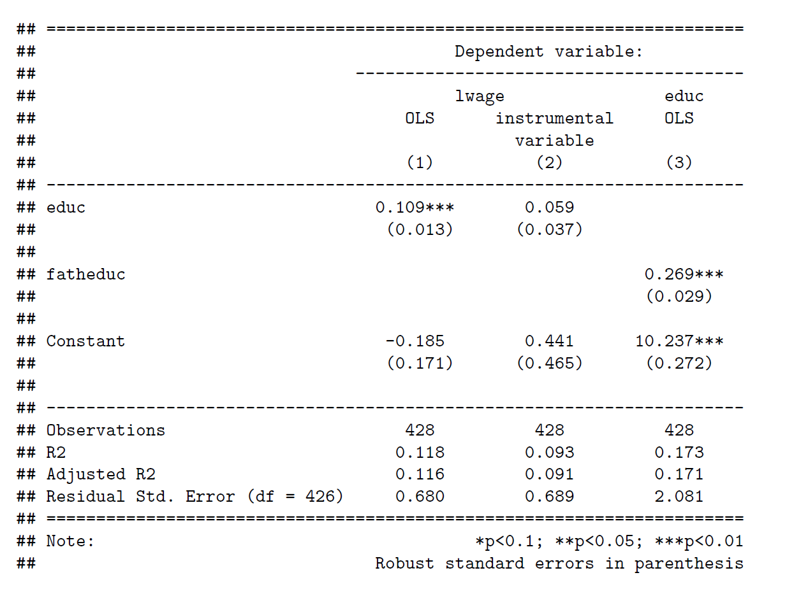
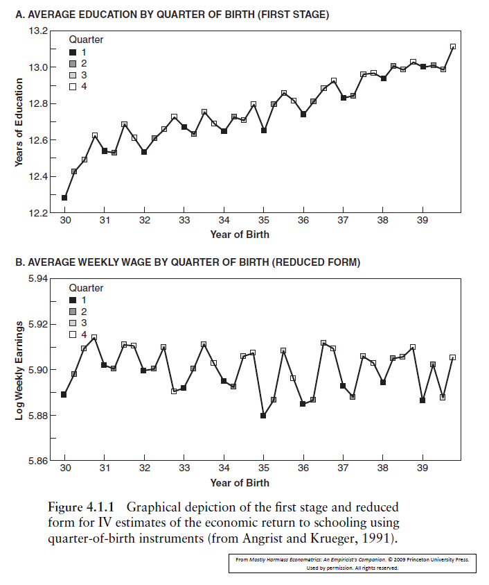
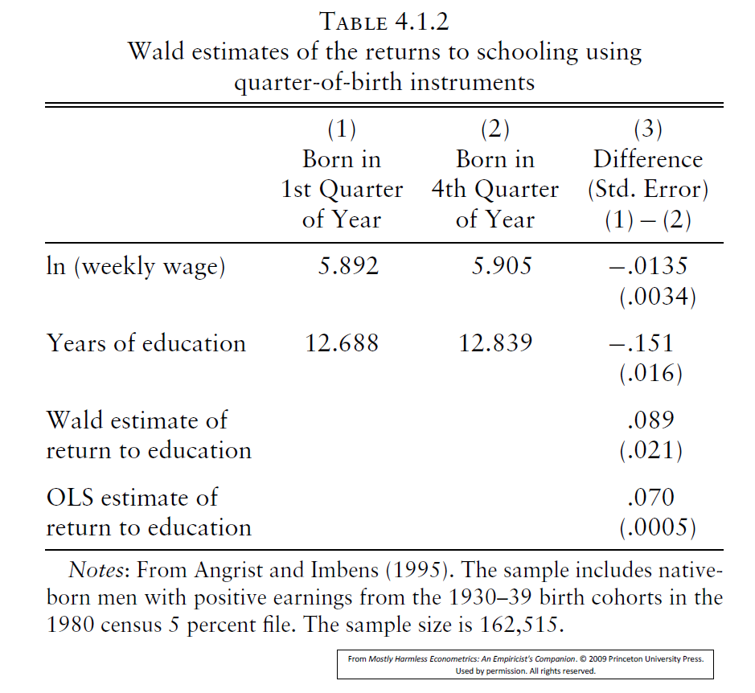

```{r setup, include=FALSE}
knitr::opts_chunk$set(echo = FALSE, message=FALSE, warning = FALSE)
```


## Introduction and Plan

* DiD approach to policy estimation was to make assumptions that allowed us to create a counterfactual that can be used to compare a treatment groups outcomes with
* Instrumental variables (IV) estimation uses a different approach to make causal statements
* Identify variation in a variable of interest that can be assumed to be exogenous

## Endogeneity Recap
The recurring theme throughout this unit is omitted variables bias caused by unobserved heterogeneity:


$$y=\beta_{0}+\beta_{1} x+\beta_{2} w+e \quad \operatorname{Cov}(e, x)=\operatorname{Cov}(e, w)=\mathrm{E}(e)=0$$


$w$ is unobserved, and so OLS applied to


\begin{equation*}
y=\beta_{0}+\beta_{1} x+u, \tag{1}
\end{equation*}


is biased and inconsistent.

Inconsistent is really bad, as it means biased in large samples. Even the Central Limit Theorem cannot help.

## Endogeneity Recap

The problem is that $x$ is endogenous:


\begin{eqnarray}
u & =&\beta_{2} w+e \\
\operatorname{Cov}(u, x) & =&\beta_{2} \operatorname{Cov}(w, x)+\operatorname{Cov}(e, x) \\
& =&\beta_{2} \operatorname{Cov}(w, x) \neq 0
\end{eqnarray}


In other words,


\begin{equation*}
\operatorname{Cov}(x, u) \neq 0 \tag{2}
\end{equation*}


unless $x$ and $w$ are uncorrelated.

Recall example where $y$ is wage, $x$ is educ, and $u$ includes $w=a b i l$ (unobserved).


## Intuition for Instrumental Variables

Suppose we can find a variable $z$ whose changes are associated with $x$, but not $u$ :

$$
\begin{array}{lllll}
z & \rightarrow & x & \rightarrow & y \\
& & \uparrow & \nearrow & \\
& & u & &
\end{array}
$$

* This variable $z$, from outside the model, induces a causal chain from $z$ to $x$ to $y$.
* This idea only works if $z$ doesn't affect $y$ directly.

## Intuition for Instrumental Variables

* Consider the wage-education example.
* Suppose $\Delta z=1$ leads to $\Delta x=0.2$ years increase in education. This then leads to $\Delta x=UKP 500$ more annual earnings.
* The causal effect of $x$ on $y$ is $\Delta y / \Delta x=500 / 0.2=2,500$ pounds per year of education:

$$
\widehat{\beta}_{1, I V}=\frac{\Delta y / \Delta z}{\Delta x / \Delta z}=\frac{500}{0.2} .
$$


## The Instrumental Variables Estimator

The model is

\begin{equation*}
y=\beta_{0}+\beta_{1} x+u \tag{1}
\end{equation*}

and $x$ is endogenous:

\begin{equation*}
\operatorname{Cov}(x, u) \neq 0 \tag{2}
\end{equation*}

* We need another exogenous variable $z$, called an Instrumental Variable, because $x$ is now endogenous.
* The Instrumental Variables (IV) Estimator is used instead of OLS when $\operatorname{Cov}(x, u) \neq 0$. The technique is similar to OLS.
* Thus, IV can be used to address the problem of omitted variables bias
* Additionally, IV can be used to solve the other endogeneity issues discussed at length in Lecture 4, namely measurement error bias and simultaneity bias.


## Conditions for a Valid Instrumental Variable
In order for a variable, $z$, to serve as a valid instrument for $x$, the following must be true

1. The instrument must be exogenous:  
\begin{equation*}*
\operatorname{Cov}(z, u)=0 \tag{AIV1}
\end{equation*}

2. The instrument must be correlated with the endogenous variable $x$ :  
\begin{equation*}
\operatorname{Cov}(z, x) \neq 0 \tag{AIV2}
\end{equation*}

3. $z$ does not belong in (1), the model being estimated. This is AIV3.

## Which conditions are testable?

* **AIV1** We have to use common sense and/or economic theory to decide whether we should assume $\operatorname{Cov}(z, u)=0$
* **AIV2** We can see whether $\operatorname{Cov}(z, x) \neq 0$ by testing $H_{0}: \pi_{1}=0$ in  
\begin{equation*}
x=\pi_{0}+\pi_{1} z+v \tag{3}
\end{equation*}

Often known as the first-stage regression.

* **AIV3** We have to use common sense and/or economic theory to decide whether $z$ should be in (1)


## Where do IVs come from?
* The choice of appropriate IVs is where econometrics/applied economics become an intellectual activity. In most cases, it is very hard to think of valid instruments, let alone have data on them.
* Stock and Watson (Section 12.5) say there are two main approaches:
  1. Use Economic Theory.
  2. Find some exogenous source of variation in $x$ arising from some random phenomenon. 
  
In the wage/education example, could use (a) family background variables, eg fatheduc or motheduc or sibs (see below); (b) proximity to school/college; (c) month of birth (see below).

## The IV Estimator (in the population)

* Apply the Covariance Operator using $z$ to (1) (the simple regression model):  
$$
\operatorname{Cov}(z, y)=\beta_{1} \operatorname{Cov}(z, x)+\operatorname{Cov}(z, u)
$$

At this stage we have assumed AIV3 is true.

* Now impose AIV1:  
$$
\operatorname{Cov}(z, y)=\beta_{1} \operatorname{Cov}(z, x)+\text { zero }
$$  
The IV Estimator in the population is:  
\begin{equation*}
\beta_{1}=\frac{\operatorname{Cov}(z, y)}{\operatorname{Cov}(z, x)} \tag{4}
\end{equation*}

* See why AIV2 is needed; without it division by zero!


## The IV Estimator (in the sample)

* Thus the IV estimator for $\beta_{1}$ is  
\begin{equation*}
\widehat{\beta}_{1}=\frac{\sum\left(z_{i}-\bar{z}\right)\left(y_{i}-\bar{y}\right)}{\sum\left(z_{i}-\bar{z}\right)\left(x_{i}-\bar{x}\right)} \quad \text { and } \quad \widehat{\beta}_{0}=\bar{y}-\widehat{\beta}_{1} \bar{x} \tag{5}
\end{equation*}

* When $z=x$, or "$x$ is used as an IV for itself", IV estimator reduces to OLS:  
$$
\widehat{\beta}_{1}=\frac{\sum\left(x_{i}-\bar{x}\right)\left(y_{i}-\bar{y}\right)}{\sum\left(x_{i}-\bar{x}\right)^{2}} \quad \text { and } \quad \widehat{\beta}_{0}=\bar{y}-\widehat{\beta}_{1} \bar{x}
$$  
Thus, OLS is a special case of IV.
* Recall the reason why OLS is unbiased is $\operatorname{Cov}(x, u)=0$.
* It turns out that IV is consistent if $\operatorname{Cov}(z, u)=0$. Consistent means unbiased, but only in large samples.
* Usually sample sizes in micro-econometrics are large enough.


## The Reduced Form

To summarise, the complete model is:

\begin{eqnarray*}
y&=&\beta_{0}+\beta_{1} x+u  \\
x&=&\pi_{0}+\pi_{1} z+v 
\end{eqnarray*}

The regression of $x$ on $z$ and a constant is the reduced form for $x$ but also called the **first stage**.

Substitute out for $x$, the endogenous RH variable:

\begin{eqnarray*}
y & =\beta_{0}+\beta_{1}\left(\pi_{0}+\pi_{1} z+v\right)+u \\
& =\left(\beta_{0}+\beta_{1} \pi_{0}\right)+\beta_{1} \pi_{1} z+\left(\beta_{1} v+u\right)
\end{eqnarray*}

The regression of $y$ on $z$ and a constant is the reduced form for $y$.

## The Reduced Form

* $\Delta y / \Delta z=\beta_{1} \pi_{1}$ reflects the two steps in the causal chain from $z$ to $x$ to $y$.
* Using the first-stage/reduced-form for $x$, Equation (3), $\Delta x / \Delta z=\pi_{1}$, the ratio of the effects of $z$ on $y$ and $x$ gives:  
$$
\beta_{1}=\frac{\Delta y / \Delta z=\beta_{1} \pi_{1}}{\Delta x / \Delta z=\pi_{1}} .
$$
* Taking the reduced form (for $y$) estimator and dividing by the first stage estimator is sometimes called the Wals estimator.

## Inference with IV Estimation

* As with OLS, there is formula that R/Stata/etc know about when producing robust standard errors. You don't need to know this formula.
* However, it turns out that:  
$$
\frac{\widehat{\operatorname{se}}\left(\widehat{\beta}_{1, I V}\right)}{\widehat{\operatorname{se}}\left(\widehat{\beta}_{1, O L S}\right)} \approx \frac{1}{\sqrt{R_{x, z}^{2}}}
$$
* If $R^{2}=1$, expression is same as OLS ( $x$ and $z$ perfectly correlated).
* Since $R^{2}<1$, IV standard errors are larger
* The weaker the correlation between $z$ and $x$, the larger the IV standard errors. This leads to the concept of a weak instrument.

## Returns to Education, using Mroz Dataset

* The model being estimated is a classic returns-to-education model.
* We want an IV that is correlated with years-of-education, uncorrelated with ability, and does not affect the log-wage directly. Also, has to be observable (in the dataset).
* Use fatheduc as an IV. It is the years-of-education of the individual's father one generation before. The dataset also has the same variable for the individual's mother and the number of siblings.
* The results are tabulated on the next slide. See the Lecture code.


## Returns to Education, using Mroz Dataset




## Check 3 conditions for a valid Instrumental Variable

* **AIV1** Is $z$ uncorrelated with $u$ ? Cannot test this. Probably No. Because father's education will be correlated with father's ability, and ability is correlated through generations.
* **AIV3** Does $z$ belong in wage equation? Cannot test this. Probably No. Employers dont pay individuals more just because their fathers had more education. $\checkmark$
* **AIV2** It is $z$ correlated with $x$ ? We can test this. Column (3) of the preceding table reports the first stage regression (in col 3) and the effect is very significant. The estimate of $\pi_{1}$ is 0.269 (0.029). $\checkmark$

## Interpret results

* Looks like OLS does produce inconsistent estimate that is too big due to omitted variables bias.
* However, the IV standard error is 3 x bigger (0.0369) than OLS ( 0.0134 ) because instrument is relatively "weak" ( $\operatorname{corr}(x, z)$ is low). Note that  
$$
\frac{\widehat{\operatorname{se}}\left(\widehat{\beta}_{1, I V}\right)}{\widehat{\operatorname{se}}\left(\widehat{\beta}_{1, O L S}\right)}=\frac{1}{\sqrt{R_{x, z}^{2}}}, \quad \frac{0.0369}{0.0134} \approx \frac{1}{\sqrt{0.173}}
$$

* Confidence intervals. OLS: $0.11 \pm 0.03=(0.08,0.14)$ ; IV: $0.06 \pm 0.07=(-0.01,0.13)$
* Bottom line: AIV1 is problematic and we don't learn much anyway because the IV s.e is big.


## Returns to Education, Angrist and Krueger (1991)

* In AK Fig 4.1.1A below, we can see a seasonal pattern in years of education for men born in the 1930s. To quote:  
"the combination of school start age policies and compulsory schooling laws creates a natural experiment in which children are compelled to attend school for different lengths of time depending on their birthdays."
* In AK Fig 4.1.1B, men born in early quarters earn less, on average, than those born later in the year  
"Because an individual's date of birth is probably unrelated to his or her innate ability, motivation, or family connections $[E(z u)=0]$, it seems credible to assert that the only reason for the up-and-down quarter-of-birth pattern in earnings is [the same] pattern in schooling [ $z$ affects $y$ only via $x$ ]."

## Returns to Education, Angrist and Krueger (1991)



## Returns to Education, Angrist and Krueger (1991)



## Returns to Education, Angrist and Krueger (1991)

* Denote $z=1$ if born in qtr 1 and $z=0$ if born in qtr 4 .
* From Table 4.1.2, the Wald/IV estimate is:  
$$
\widehat{\beta}_{1}=\frac{\bar{y}_{1}-\bar{y}_{0}}{\bar{x}_{1}-\bar{x}_{0}}=\frac{-0.0135}{-0.151}=0.089(0.021) .
$$
* The OLS regression of $y$ on $x$ is $0.070(0.0005)$. As it smaller than Wald/IV, ability bias is not the issue here.
* Both the 'top' and 'bottom' estimates are small, but are significant.
* All of the standard errors reported in the table come from running the corresponding regressions.

## Returns to Education, Angrist and Krueger (1991)

* However, the price paid is the inflated standard error of $0.021 / 0.0005 \approx 40$. Even though the estimate is still significant (because of very large sample size), the $95 \% \mathrm{CI}$ is large. What do we really learn from this?
* See Stock \& Watson p483 A Scary Regression, Wooldridge pp502-03 and mastering Metrics pp228-34..
* This is all because the $R_{x, z}^{2}$ is very small.
* Weak instruments are a real problem in micro-econometrics. Angrist and Krueger (1991) is the classic early example.


## IV from randomisation

A common source of an instrument is some element of randomisation.

Of course, if we had a RCT (like the Finnish Basic Income example), then there would be no problem. The treatment variable can be used to establish causal effects.

But there will often be randomisation schemes that fall "short" of a RCT.

* A random subset of students may get an email to encourage them to read the textbook. Can a dummy variable indicating who got the email be an instrument for reading the textbook?

\begin{eqnarray}
  y &=& \alpha + \beta x + u
  x = \gamma + \delta * x + e
\end{eqnarray}

where $y$ is grade in QM, $x$ represents the average time a week you spend on reading the textbook and $z$ is 1 if you received the email encouraging the textbook reading and 0 otherwise.

## IV from randomisation

What are we hoping for?

* $Cov(u,z)=0$
* $Cov(x,z)\neq 0$
* $z$ does not belong into the model for $y$.

We also need that there is monotonicity in $\Delta x/\Delta z$, which means that receiving $z$ does not have opposite effects on students.

## References

* Wooldridge, Introductory Econometrics, Ch.15
* Angrist and Pischke, Mastering 'Metrics, Ch. 3
* Stock and Watson, Introduction to Econometrics, Ch.12


