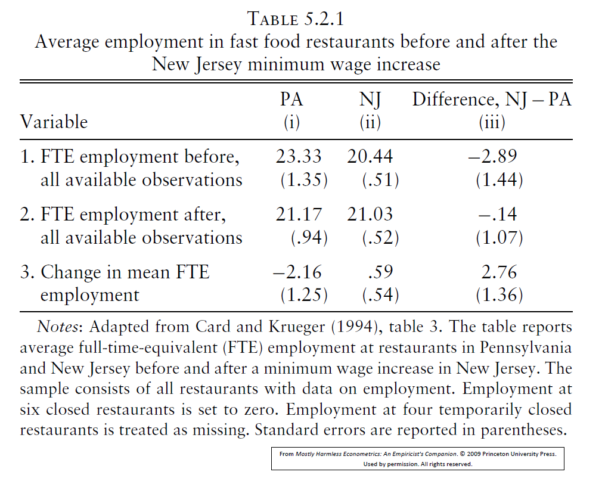
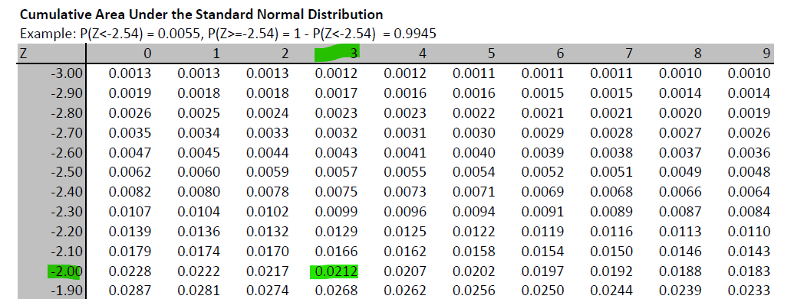
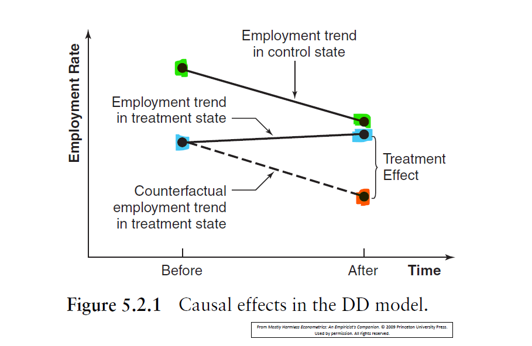
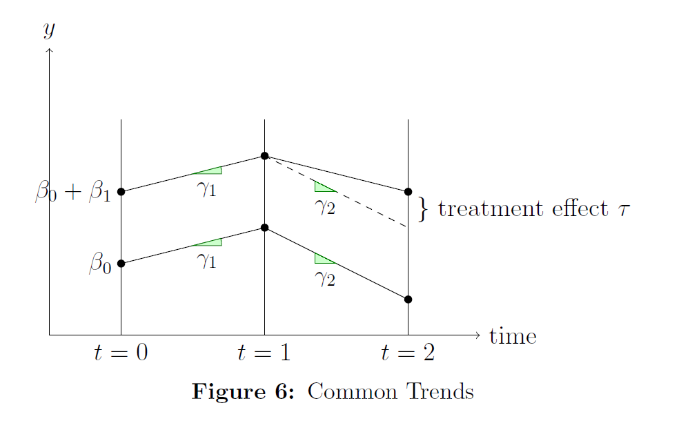
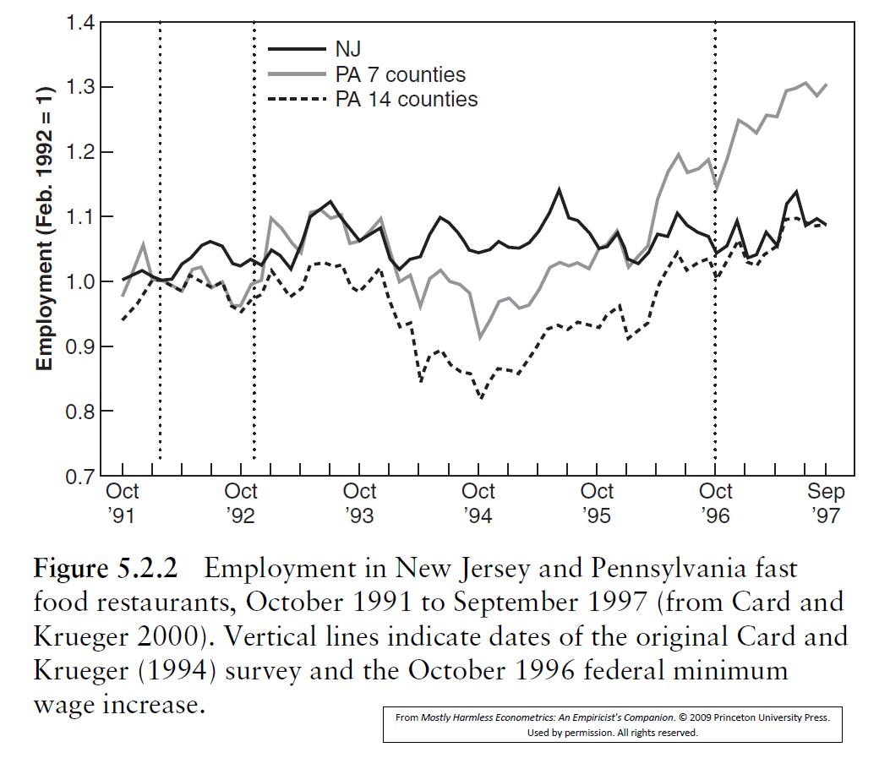
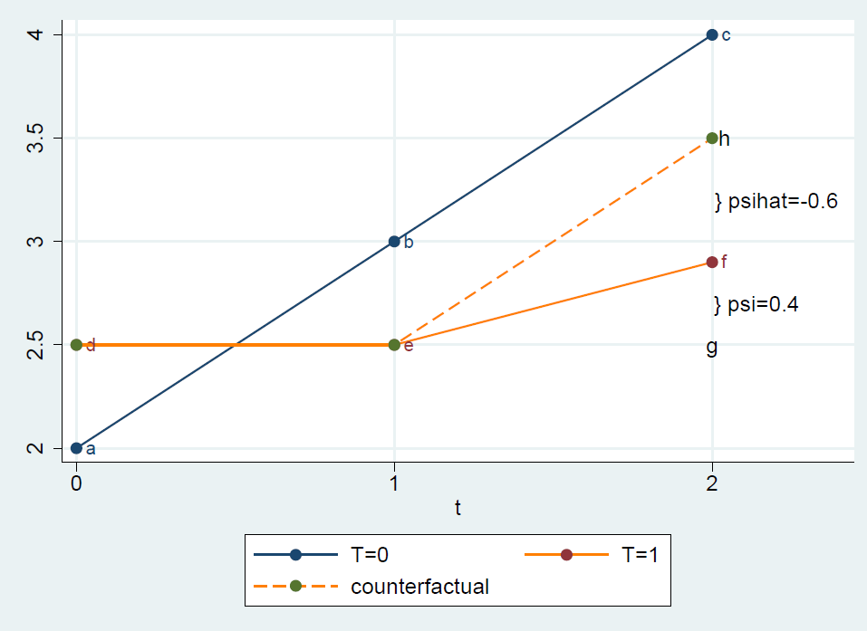
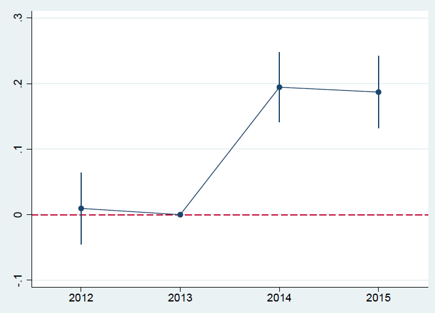

```{r setup, include = FALSE}
knitr::opts_chunk$set(echo = FALSE)

library(webexercises)
```

```{r, echo = FALSE, results='asis'}
# Uncomment to change widget colours:
#style_widgets(incorrect = "goldenrod", correct = "purple", highlight = "firebrick")
```

These notes are larely based on notes initially written by my colleague Martyn Andrews.


## Introduction and Set-up

Evaluating microeconomic policies is one of the most important uses of microeconometrics.  Typical examples of policy evaluations are:

* The effects of class-sizes on school achievement.
* The effects of job-training programs on subsequent labour market outcomes.
* The effects of the Education Maintenance Allowance on subsequent participation in education.
* The effects of tobacco taxes and smoking bans on smoking and cigarette consumption.
* The effect of the introduction of a sugar tax on fizzy drinks consumption.
* The effects of policies aiming to encourage lone parents into the labour market.
* The effects of gun-control laws on deaths by firearms in the US.
* The effects of introducing of a minimum wage on employment of low paid workers in the UK. And in certain states in the US.

Typically there is a **treatment** $w$ and a **response** $y$. If $w$ is a dummy (eg a training program) then it looks as if a standard regression of $y$ on $w$ plus controls might deliver what the policy-maker is after.  To preview where we are headed, the answer is "yes" if we have access to panel data.  Otherwise, if we have pooled cross-sections, our regression model needs tweaking a tad.

### Policy analysis with two-period panel data {#sec-2pp}

We start with panel data and use the set-up and results in the Panel-Data Section.

Define $w_{it}$ as a dummy variable for whether and when an individual undertook the program/received the treatment.  $D^2_{t}$ is the period-two dummy.  We further assume that the treatment only occurs in $t=2$, if at all, so that $w_{i1}=0$ for everyone.  The table below illustrates the data.


| $i$    | $t$    | $y_{it}$ | $w_{it}$ | $D^2_t$  | ($T_{i}$) | $\mathbf{x}_{it}$ | $\Delta y_{i}$ | $\Delta w_{i}$  | $\Delta D^2_t$  | $\Delta \mathbf{x}_{i}$ |
|--------|--------|----------|----------|----------|-----------|-------------|----------------|-----------------|-----------------|-------------------|
| 1      | 1      | $y_{11}$ | 0        | 0        | (0)       | $\mathbf{x}_{11}$ | .              | .               | .               | .                 |
| 1      | 2      | $y_{12}$ | 0        | 1        | (0)       | $\mathbf{x}_{12}$ | $\Delta y_{1}$ | 0               | 1               | $\Delta \mathbf{x}_{1}$ |
| 2      | 1      | $y_{21}$ | 0        | 0        | (1)       | $\mathbf{x}_{21}$ | .              | .               | .               | .                 |
| 2      | 2      | $y_{22}$ | 1        | 1        | (1)       | $\mathbf{x}_{22}$ | $\Delta y_{2}$ | 1               | 1               | $\Delta \mathbf{x}_{2}$ |
| ... | ... | ...   | ...   | ...   | ...    | ...      | ...         | ...          | ...          | ...            |
| $N$    | 1      | $y_{N1}$ | 0        | 0        | (1)       | $\mathbf{x}_{N1}$ | .              | .               | .               | .                 |
| $N$    | 2      | $y_{N2}$ | 1        | 1        | (1)       | $\mathbf{x}_{N2}$ | $\Delta y_{N}$ | 1               | 1               | $\Delta \mathbf{x}_{N}$ |


To the left we have the data in levels, sorted by $i$ and then $t$.  The model to be estimated, written without covariates, is:

\begin{equation*}
y_{it} = \beta_0 + \delta D^2_t + \tau w_{it} + a_i + u_{it}.
\end{equation*}

where $\tau$ is the coefficient that describes the impact $w_{it}$ has on the outcome variable. If $w_{it}$ is a policy variable as it was introduced above, then $\tau$ represents a policy affect. As always, one might also include some $x_{it}$s. As explained in the Panel Data Section, with panel data we are able to control for unobserved, time-invariant, heterogeneity $a_i$.  To do this, we difference the above equation:

$$\Delta y_{i} = \delta + \tau \Delta w_{i} + \Delta u_{i}.$$ {#eq-did1}

In the right-hand part of the table, the data have been first-differenced.  There are no data in $t=1$ and so we have a
cross-section of first-differences.  Also note that, in $t=2$,

\begin{equation*}
\Delta w_{i} = w_{i2}.D^2_{2}=w_{i2}.
\end{equation*} 

Effectively we are regressing $\Delta y_{i}$ on $w_{i2}$ and a constant. With $w_{i2}$ being a dummy variable this implies:

\begin{eqnarray*}
\hat{\tau}  &=& \overline{\Delta y}_{T} - \overline{\Delta y}_{C}\\
\hat{\delta}  &=& \overline{\Delta y}_{C}
\end{eqnarray*}

where $T$ denotes the **treated** group and $C$ denotes the **control** group. And 

* $\overline{\Delta y}_{T}$ is the sample average of the change in $y$ for the treated group; and
* $\overline{\Delta y}_{C}$ is the same for the control group.

The key result is that using OLS on @eq-did1 gives $\hat{\tau}$, which is the **difference-in-differences** (DiD) estimator.  The name comnes from $\hat{\tau}$ calculating the difference between two differences.

As noted, the DiD estimator has the important advantage of being able to control for unobserved heterogeneity $a_i$.  We can also add
(differenced) controls for any time-varying variables/covariates that might be correlated with program designation.

If program participation takes place in both periods, @eq-did1 no longer applies, but the interpretation is the same.  Regress $\Delta y_{i}$ on $\Delta w_{i}$, $\Delta\text{covariates}$ and a constant. It is important, however, that DiD does not require panel data; there is a version that uses pooled cross-sections (see below).


### Policy analysis with pooled cross-sections

When we have pooled cross-sections, the data look like the following, where we have $N_1$ observations in period 1 and $N_2$ in period 2.

| $i$     | $t$    | $y_{it}$      | $w_{it}$ | $D^2_t$  | $T_{i}$ | $\mathbf{x}_{it}$      |
|---------|--------|---------------|----------|----------|----------|------------------|
| 1       | 1      | $y_{11}$      | 0        | 0        | 0        | $\mathbf{x}_{11}$      |
| 2       | 1      | $y_{21}$      | 0        | 0        | 1        | $\mathbf{x}_{21}$      |
| ...  | ... | ...        | ...   | ...   | ...   | ...           |
| $N_1$   | 1      | $y_{N_1,1}$   | 0        | 0        | 1        | $\mathbf{x}_{N_1,1}$   |
| $N_1+1$ | 2      | $y_{N_1+1,2}$ | 0        | 1        | 0        | $\mathbf{x}_{N_1+1,2}$ |
| $N_1+2$ | 2      | $y_{N_1+2,2}$ | 0        | 1        | 0        | $\mathbf{x}_{N_1+2,2}$ |
| ...  | ... | ...        | ...   | ...   | ...   | ...           |
| $N=N_1+N_2$     | 2      | $y_{N,2}$     | 1        | 1        | 1        | $\mathbf{x}_{N,2}$     |


The important point is that the individuals $i$ are different in the two cross-sections.  The variable $T_{it}$ records whether the individual $i$ is elegible for treatment.  An example of an individual at time $t=1$ when no treatment has happened yet, is someone who would be eligible for the minimum wage, but before the policy was introduced.

::: {.callout-note}

#### Different policy variables

How are the variable $w_{it}$ in the Panel setup and $T_i$ in the cross-section setup related. In the panel we have observations for each individual at multiple times. In the cross section this is not the case. Variables like $y_{it}$ still need indexing for observation $i$ and time$t$, but we will now focus on whether an individual is elegible for the training/policy program. Therefore the treatment variable $T$ looses its time variable as we now look at elegibility rather than whether an individual at a time $t$ was receiving treatment.

Individuals with $T_i=1$ belong to the treatment group, whether you are in period $t=1$ or $2$. $T_i=0$ indicates individuals in the control group.

:::

We discussed before that in the setup of a two-period panel the estimator the policy effect was estimated as follows:

\begin{equation*}
\hat{\tau}  = \overline{\Delta y}_{T} - \overline{\Delta y}_{C}
\end{equation*}

Let's deconstruct this estimator

\begin{eqnarray*}
\overline{\Delta y}_{T} - \overline{\Delta y}_{C} &=&(\bar{y}_{2,T} - \bar{y}_{1,T}) - (\bar{y}_{2,C} - \bar{y}_{1,C}) \\
&=& \bar{y}_{2,T} - \bar{y}_{1,T} - \bar{y}_{2,C} + \bar{y}_{1,C}\\
&=& (\bar{y}_{2,T} - \bar{y}_{2,C}) - (\bar{y}_{1,T} - \bar{y}_{1,C})
\end{eqnarray*}

The averages like $\bar{y}_{2,T}$, averaging the outcome for everyone in the treatment group, can be calculated in a panel setup but equally in a pooled cross-sectional setup. The panel characteristic is not needed. This establishes the important point that the DiD estimator can be obtained using pooled cross-sections (as well as panel data).  

### Selection bias and the search for counterfactuals

We can learn a lot from this deconstruction. Let's first look at 

\begin{equation*}
\overline{\Delta y}_{T} - \overline{\Delta y}_{C} = (\bar{y}_{2,T} - \bar{y}_{2,C}) - (\bar{y}_{1,T} - \bar{y}_{1,C}) 
\end{equation*}

Let's imagine that treatment was allocated randomly to individuals, as it is in randomised conrolled trieals (RCTs). They are popular in the medical sciences and increasingly are applied in economics as well. If allocation to the treatment ($T$) and control ($C$) group are random, then $(\bar{y}_{1,T} - \bar{y}_{1,C})$ will be very close to 0 and will just represents sampling differences. Recall in period $t=1$ treatment has not yet happened.

This is why, when evaluating a RCT you only need to compare the outcomes for the $T$ and $C$ group after treatment has happened $(\bar{y}_{2,T} - \bar{y}_{2,C})$.

::: {.callout-note}

#### Basic income RCT in Finland

An example of a RCT is economics is an experiment in Finland in which a randomly chosen group of unemployed received a basic income (an unconditional payment that was not removed after finding work - unlike typical unemployment benefits). The findings are that receiving the basic income improves the well-being of the receipients but does not result in the recipients working more (which was an important purpose of paying a basic income).

**Reading**: Verho, J., Hamalainen, K. and Kanninen, O. (2022) [Removing Welfare Traps: Employment
Responses in the Finnish Basic Income Experiment, American Economic Journal: Economic Policy, 14, 501–22.](https://www.aeaweb.org/articles?id=10.1257/pol.20200143)

:::

Without random assignmen of the treatment, we need to acknowledge that there may be systematic differences in outcome between the $T$ and $C$ group. Such a difference is also called selection bias. In other words,  $(\bar{y}_{1,T} - \bar{y}_{1,C})$ will not be 0.

::: {.callout-important}

#### Example for selection bias

Let's engage in a little thought experiment. As lecturers of econometrics we believe that the students will benefit from talking to us in drop-in sessions. These are typically two hours every week that we are being paid for (by students' tuition fees mainly) to be available to chat with students about the questions they have. Of course we argue that student outcomes (knowledge of econometrics, perhaps measured by final exam performance, at time $t=2$; let $t=1$ be the beginning of the semester) will improve for treated students (those that were in our offcie for at least one office hour in the semester).

In order to establish this you may be tempted to compare the exam performance (measured at time $t=2$) of those who were treated and those who were not: $(\bar{y}_{2,T} - \bar{y}_{2,C})$. Are you confident that this difference will tell you whether talking to your professor in drop-ins improves your econometrics knowledge?

`r mcq(c("Yes, I am confident", "not sure", answer = "No, it does not"))`

To shed light on this. Calculating the above difference would be informative of the effect of coming to drop-in sessions if $(\bar{y}_{1,T} - \bar{y}_{1,C}) \approx 0$, meaning that basically the econometrics knowledge of students at the beginning of the semester was the same. As we do not have exams at the beginning of the semester (aren't you lucky!) this is a little difficult to conceptualise. Let's think more generically about whether a student is a "good" or a "not so good" students (you who is reading this in good time and not only the night before the exam ... you are clearly a good student).

If the students who do come to drop-in sessions ($T$) and those who do not ($C$) where equally good students then indeed $(\bar{y}_{1,T} - \bar{y}_{1,C}) \approx 0$. What do you think is true?

* A: $(\bar{y}_{1,T} - \bar{y}_{1,C}) \approx 0$, students who come to drop-in sessions and students who don't are equally good students
* B: $(\bar{y}_{1,T} - \bar{y}_{1,C}) > 0$, students who come to drop-in sessions are on average better students than those who do not come
* C: $(\bar{y}_{1,T} - \bar{y}_{1,C}) < 0$, students who come to drop-in sessions are on less good students than those who do not come

`r mcq(c("A", answer = "B", "C"))`


`r hide("Why is this so?")`

It is not immediately obvious that this is true. You may think that students who struggle more would have a bigger need to talk to the professor. But experience tells us that on average better students come to office hours. Coming to office hours, asking questions, confronting what you don't know are great study habits and are the sign of a great student. 

`r unhide()`

What then is the implication for the estimator of the effect of using drop-in sessions if we were to ignore this difference?


```{r}
opts_p <- c(
   "Despite this difference we would still get a good estimate of the effect of attending office hours.",
   answer = "We would overestimate the effect of attending drop-in sessions.",
   "We would underestimate the effect of attending drop-in sessions"
)
```

`r longmcq(opts_p)`

`r hide("Why is this the answer?")`

Recall that the real effect is calculated from 

\begin{equation*}
(\bar{y}_{2,T} - \bar{y}_{2,C}) - (\bar{y}_{1,T} - \bar{y}_{1,C}) 
\end{equation*}

If we ignore the second term (which we decided was positive) then the effect we estimate is too large. Your professor would give himself a big pat on the back thinking that his explanations he shares with students in drop-in sessions are so amazing that they are the only reason why the students who attended drop-in sessions do better than others. In fact the students who attended his drop-in would have performed better without his words of wisdom. Good students selected themselves into attending drop-in sessions, selection bias is at work.

`r unhide()`

:::

It is the existence of selection bias that makes it necessary to use data from before the policy introduction. Let's return to the definition of the effects estimator but with the differences re-arranged to show the changes in the treatment and the control group across time:

\begin{equation*}
\overline{\Delta y}_{T} - \overline{\Delta y}_{C} = (\bar{y}_{2,T} - \bar{y}_{1,T}) - (\bar{y}_{2,C} - \bar{y}_{1,C})
\end{equation*}

This formulation highlights another important aspect of the Difference-in-Difference method, the choice of the **counterfactual**. The first difference $(\bar{y}_{2,T} - \bar{y}_{1,T})$ does show how the outcome variable changed from before to after the treatment in the treatment group. But we need to recognise that the treatment may not be the only thing that happened in between $t=1$ and $t=2$. This makes it obvious that we cannot just attribute this change to the treatment.

Here is the thing: **There is no causal inference without making assumptions!** Apologies for shouting, but this is how important it is. And worse, **these are usually assumptions that are untestable!** Well, this is why they are assumptions. 

In practice what we need is a **counterfactual**, a view on what the outcome variable would have been if the objects in the treatment group ($T$) had not received treatment. 

If we had a RCT this would be super easy. We would just assume that the outcomes would have been similar to the control group ($C$) outcomes, after all, by randomisation, the treatment was the only thing different between the groups. But if we do not have random treatment assignment the story is more difficult. We somehow have to predict how the treatment group would have done. And there are a lot of ways to do that and we will really only deal with two of them. 

1. If you you believe that all the variables that determine the selection bias (i.e. all the reasons why some people - or units in general - are more likely to get training and at the same time cause to create a bias in outcome variables) are observable variables (say gender, age etc) then you can control for these in a multiple regression model. This is sometimes called **selection on observables**What this model in effect does, it predicts the outcome, without treatment, using the regression model. This is basically a multiple regression model that includes the treatment variable and relevant covariates. The **assumptions are that, after controlling for the covariates, the treatment variable is exogenous and that the linear form in which the covariates relate to the outcome variable is correct.**
2. Very similar to method 1 is a method called **matching**. It still **assumes that all the factors that make the treatment potentially endogenous, are observable**. The difference is now that these factors do not have to be linearly related to the outcome variable. The matching algorithm allows for nonlinear relationships to be used when predicting the counterfactual outcome. We will not discuss any more detail here.
3. The next method to mention, and the topic of this Section is called **Difference-in-Differences (DiD)**. The crucial **assumption being made here is that, the change in outcome (from before to after the treatment period) for the treated units would have been the same as the change in outcome over the same period for the non-treated (control) units**.

This assumption is the assumption we have to make (and believe in) such that the previously discussed 

$$\overline{\Delta y}_{T} - \overline{\Delta y}_{C} = (\bar{y}_{2,T} - \bar{y}_{1,T}) - (\bar{y}_{2,C} - \bar{y}_{1,C})$$ {#eq-didest}

delivers an unbiased estimate of the effect of the treatment. The change in the treatment group $(\bar{y}_{2,T} - \bar{y}_{1,T})$ is being corrected by (or compared with) the change in the control group $(\bar{y}_{2,C} - \bar{y}_{1,C})$. This is as we are assuming/predicting that the treatment group would have changed (in absence of treatment) as the control group.


## DiD in a regression {#sec-DIDreg}

Above we introduced a DiD estimator as basically consisting of four averages. This results from the setup with two groups ($T$ and $C$) and only two time periods (above $t=1,2$). The DiD method is, however much more flexible. And in addition, even for the simple example, the regression method would deliver a standard error that can be used for statistical inference.

Let's introduce the basic regression model into which we also include covariates/controls.

$$y = \beta_0 + \delta D + \beta_1 T + \tau D.T + \text{controls} + u$$ {#eq-didreg1}

where $D$ is a time dummy for after the treatment occurs (With just $t=1,2$, we replace $D^2$ by $D$). $T$ is a dummy for all units that are being treated. The variable $D.T$ is the product of 2 dummy variables; it is a so-called **interaction**-term.

::: {.callout-note}

#### Where have all the subscripts gone?

We are conceptually still working in a 2x2 framework, two groups ($T$ or $C$) and two periods (pre and post treatment). So each observation belongs to one of the following four groups:

|time | Treatment | Control |
|:------|------|-------|
|pre ($t=1$) | $T = 1, D = 0$ | $T = 0, D = 0$ |
|post ($t=2$)| $T = 1, D = 1$ | $T = 0, D = 1$ |

Indices $i$ and $t$ will be reintroduced later when they are necessary to identify the observations clearly. But for now it is the values of $D$ and $T$ that do the job allowing us to lighten the notation.

:::

Now interpret the parameters of @eq-didreg1 **without** the control variables. As always, we switch the 2 dummies on/off:

\begin{align*}
E (y | D=0, T=0) &= \beta_0                    + E (u | D=0, T=0) \\
E (y | D=0, T=1) &= \beta_0          + \beta_1 + E (u | D=0, T=1) \\
E (y | D=1, T=0) &= \beta_0 + \delta           + E (u | D=1, T=0) \\
E (y | D=1, T=1) &= \beta_0 + \delta + \beta_1 + \tau +  E (u | D=1, T=1).
\end{align*}

Next assuming exogeneity (The error term being uncorrelated to $D$ and $T$)

$$E (u | D=0, T=0)=E (u | D=0, T=1)=E (u | D=1, T=0)=E (u | D=1, T=1)=0.$$

Then

\begin{align*}
E (y | D=0, T=0) &= \beta_0                     \\
E (y | D=0, T=1) &= \beta_0          + \beta_1  \\
E (y | D=1, T=0) &= \beta_0 + \delta            \\
E (y | D=1, T=1) &= \beta_0 + \delta + \beta_1 + \tau.
\end{align*}

Now solve for the 4 parameters:

\begin{align*}
\beta_0 &= E (y | D=0, T=0) \\
\beta_1 &= E (y | D=0, T=1) - E (y | D=0, T=0) \\
\delta  &= E (y | D=1, T=0) - E (y | D=0, T=0)
\end{align*}

and

$$\tau =  [E (y | D=1, T=1) - E (y | D=0, T=1)] - [E (y | D=1, T=0) - E (y | D=0, T=0)].$$

$\tau$ is the DiD estimator in the population. The sample analogue is given in @eq-didest.

$\delta$ and $\beta_1$ are "single" differences, or population differentials:

* $\delta$ is the effect of time, a so-called **macro effect**, but only for the control group.
* $\beta_1$ is a treatment effect, but only **before** the policy was introduced. It represents the selection bias.

When estimated by OLS, $\hat{\beta}_0$, $\hat{\beta}_1$, $\hat{\delta}$, and $\hat{\tau}$ will replicate exactly the corresponding sample means.  

\begin{align*}
\hat{\beta}_0 &= \bar{y}_{1,C} \\
\hat{\beta}_1 &= \bar{y}_{2,C}-\bar{y}_{1,C} \\
\hat{\delta}  &= \bar{y}_{1,T}-\bar{y}_{1,C}
\end{align*}

and finally

\begin{align*}
\hat{\tau}    &= (\bar{y}_{2,T}-\bar{y}_{2,C})-(\bar{y}_{1,T}-\bar{y}_{1,C}) \\
           &= (\bar{y}_{2,T}-\bar{y}_{1,T})-(\bar{y}_{2,C}-\bar{y}_{1,C}).
\end{align*}

So why do we bother using a regression model when sample means are easily computed?  First, additional $x$'s can be added to the regression to control for observable differences between the treatment and control groups over the two periods.  Second, a standard error on $\hat{\tau}$ is automatically estimated (see below). Third, the regression form can be extended in various directions (again, see below).

### Panel data versus pooled cross-sections

How do the two approaches gel? Suppose we had access to panel data but "accidentally" estimated @eq-didreg1, written out again, this time with subscripts:


$$y_{it} = \beta_0 + \delta D_t + \beta_1 T_i + \tau D_tT_i + \text{controls} + u_{it}$$ {#eq-didreg1v2}

Compare this with the model we used for the two period panel setup (now explicitly allowing for additional control variables):

$$y_{it} = \beta_0 + \delta D_t +  a_i + \tau w_{it} +\text{controls} + u_{it}.$$ {#eq-did2pp}

which we proposed to estimate using first differences (FD) such as to eliminate the unobservable $a_i$s.

$w_{it}$ in @eq-did2pp is identical to the interaction $D_t T_i$ in @eq-didreg1v2, only taking the value one fro treated units after treatment has happened and 0 otherwise.

One can see that the dummy $T_i$ in @eq-didreg1v2 plays the same role as the unobserved effect $a_i$ in the panel version @eq-did2pp.

But, in both approaches, $\tau$ is the DiD parameter. Indeed, with panel data, the estimates from @eq-didreg1v2 using POLS are numerically identical to those from @eq-did2pp using FD.

And, in both approaches, we only have 4 aggregated datapoints:  $\bar{y}_{2,T}$, $\bar{y}_{2,C}$, $\bar{y}_{1,C}$, $\bar{y}_{2,T}$ and $\hat{\tau} = (\bar{y}_{2,T}-\bar{y}_{2,C})-(\bar{y}_{1,T}-\bar{y}_{1,C})$.  This is why the panel versus pooled issue is not that important.

::: {.callout-note}

#### Card and Krueger (1994)

Card and Krueger (1994) is the classic example of a DiD regression.  It examines the employment effects of the 1992 increase in the minimum wage in New Jersey fast-food outlets, which didn't happen in Pennsylvania.  In competitive markets, increases in the minimum wage moves the equilibrium up a downwards-sloping labour demand curve, reducing employment.  Minimum wage legislation might hurt the very workers it intends to help.

But labour markets may not behave like classical markets in perfect competition and therefore it is first and foremost an empirical question to understand whether minimum wage increases do indeed effect employment negatively.

On April 1 1992, New Jersey (NJ) raised the state minimum from USD4.25 to USD5.05. In Pennsylvania (PA) the minimum wage stayed at USD4.25. Card and Krueger collected data on employment at fast food restaurants in both states in February 1992 (**before/pre**) and November 1992(**after/post**) the minimum wage increase. The data are a panel, like those illustrated in @sec-2pp. There are 79 restaurants in PA and 331 restaurants in NJ.

The four sample means that are used to construct the DiD estimator are presented in Table 5.2.1 in Angrist and Pischke's (AP) Mastering Metrics.



Employment in the treatment group increased by 0.59 $(\bar{y}_{2,T}-\bar{y}_{1,T})$ whereas the conterfactual, i.e. the assumption of what would have happened in absence of the policy is $-2.16$ $(\bar{y}_{2,C}-\bar{y}_{1,C})$. Adjusting the actual change with this counterfactual, results in the DiD estimate of an increase of $\hat{\tau}=2.76$. The values in parenthesis are standard errors which are automatically obtained when using one of the above regression approaches. The standard error for $\hat{\tau}$ is 1.36. 

If testing $H_0:\tau = 0$ versus $H_A: \tau \neq 0$, would you reject the null hypothesis at a 5% significance level?

`r mcq(c(answer = "Reject H0", "Do not reject H0", "not enough information"))`

`r hide("How to decide?")`

This is a standard t-test. We need to calculate the t-statistic which is 

$$t-stat = \frac{2.76-0}{1.36}= 2.0294$$

Then we can go to a standard normal table to get the p-value. We need to figure out what probability is cut off in the tail of the standard normal distribution by 2.03 (or -2.03 as per symmetry). 



You can see from the extract of the standard normal distribution table that the tail probability is $Pr(Z<-2.03) = 0.0212$ and therefore, the p-value for the above test is 0.0424. This is smaller than the set $\alpha = 0.05$ and therefore the null hypothesis is rejected.

`r unhide()`

Since this seminal paper, it turns out that this positive effect has been found in many, many other studies. But also note that the findings are  also very situation dependent and it would be wrong to say that increases in minimum wages always have positive employment effects.

But how convincing is the evidence against the standard labour demand argument we outlined above?

In addition to the usual exogeneity assumption, the second key **assumption is that employment trends would be
the same in both states in the absence of treatment**. The next section discusses this assumprion.

:::

## The common trends assumption {#sec-commonT}

As outlined above, causal inference does not work without making assumptions. The assumption that underlies all DiD models is the common trends assumption, sometimes also called the parallel trends assumption.

### Common trends with 2 periods

The figure below is also taken from AP (their Figure~5.2.1).



4 of the 5 highlighted points on the figure represent the 4 sample means $\bar{y}_{1,C}$, $\bar{y}_{2,C}$ (both highlighted in green), $\bar{y}_{1,T}$ and $\bar{y}_{2,T}$ (both highlighted in blue).  It is easy to see that the DiD estimator, $\tau \equiv (\bar{y}_{2,T}-\bar{y}_{2,C})-(\bar{y}_{1,T}-\bar{y}_{1,C})$ (highlighted in orange), is the vertical brace.  However, it is also easy to see that one has to **assume** that the counterfactual dotted line is parallel to the corresponding employment trend in the control state; it is a counterfactual because it is what we assume would have happened had the policy not been introduced. Without this assumption, $\tau$ and $(\bar{y}_{2,T}-\bar{y}_{2,C})-(\bar{y}_{1,T}-\bar{y}_{1,C})$ bear no relation with each other.  This is the key **identifying assumption** in DiD models.

Is there any way of examining the data to assess whether the common trends assumption is true or not? Unfortunately not. Especially not in a situation where we only have 2x2 setup. Why?  Without going into details, there is an intercept (say $\beta_0$) and slope $\gamma_C$ for the control group and an intercept (say $\beta_0+\beta_1$) and slope $\gamma_T$ for the treated group.  One also wants to identify/estimate a treatment effect $\tau$.

The problem is that there are 5 parameters ($\beta_0$, $\beta_1$, $\gamma_C$, $\gamma_T$, $\tau$), and just 4 datapoints ($\bar{y}_{1C}$, $\bar{y}_{1T}$, $\bar{y}_{2C}$, $\bar{y}_{2T}$). 

Later you will see that having more observations, in particular having more than one pre-treatment periods, can deliver suggestive evidence for or against the validity of the common trends assumption, but essentially it will always remain an assumption.

### Common trends with 3 periods {#sec-CTT3}


We now formalise these points.

Suppose there are 3 periods $t=0,1,2$ and hence 6 datapoints: $\bar{y}_{0,C}$, $\bar{y}_{0,T}$, $\bar{y}_{1,C}$, $\bar{y}_{1,T}$, $\bar{y}_{2,C}$, $\bar{y}_{2,T}$.  The treatment, if it occurs, is between $t=1,2$.

When there were 2 periods, the appropriate regression was $y$ on $\{1,D,T,DT \}$.  Now there are 3 periods, we need a period~1 dummy, labelled, $D^1$, and a period~2 dummy, labelled, $D^2$.  This means that an obvious regression has $1,D^1,D^2$ on the RHS plus the same interacted with $T$, making 6 regressors in total:  $\{1,D^1,D^2,T,D^1T,D^2T \}$.  (Any extra controls are ignored throughout this discussion but will be added if required). The model is written:

\begin{eqnarray*}
y &=& \beta_0 + \delta_{1} D^1 + \delta_2 D^2 + \\
&& \delta_3 T +  \delta_4 D^1T + \delta_5 D^2T + u.
\end{eqnarray*}

But it will actually be useful to write coefficients of the model slightly differently.

\begin{eqnarray*}
y &=& \beta_0 + \gamma_{1C} D^1 + (\gamma_{2C}+\gamma_{1C}) D^2 + \\
&& \beta_1 T +  (\gamma_{1T} - \gamma_{1C}) D^1T + [\tau + (\gamma_{2T}-\gamma_{2C})+(\gamma_{1T}-\gamma_{1C})] D^2T + u.
\end{eqnarray*}

We now have seven coefficients ($\beta_0$, $\beta_1$, $\gamma_{1C}$, $\gamma_{1T}$, $\gamma_{2C}$, $\gamma_{2T}$ and $\tau$), but the regression coefficients are now combinations of these new coefficients. This will help us understand how the coefficients relate to the common trends assumption.

To see where the parameters come from, write out the model 6 times for all combinations of time $t$ nad treatment status $T$:

\begin{align}                                                                 \notag
E(y | t=0, T=0) &= \beta_0                                               \\ \notag
E(y | t=1, T=0) &= \beta_0 +  \gamma_{1C}                                \\ \notag
E(y | t=2, T=0) &= \beta_0 +  \gamma_{2C}+\gamma_{1C}                  \\ \notag
E(y | t=0, T=1) &= \beta_0 +                             \beta_1         \\ \notag
E(y | t=1, T=1) &= \beta_0 +  \gamma_{1T}              + \beta_1         \\
E(y | t=2, T=1) &= \beta_0 +  \gamma_{2T}+\gamma_{1T} + \beta_1 + \tau. \notag
\end{align}

Then plot these 6 population means, as in the following Figure.

 

The seven coefficients ($\beta_0$, $\beta_1$, $\gamma_{1C}$, $\gamma_{1T}$, $\gamma_{2C}$, $\gamma_{2T}$ and $\tau$) are essentially the pieces of information we wish to obtain from the data, but unfortunately there are only 6 data points! This by itself makes it obvious that we need to restrict one of these. This is what the common trends assumption does. Only by setting $\gamma_{2T}=\gamma_{2C}=\gamma_{2}$ can we actually identify the parameter we care most about, the policy effect $\tau$.

In this case, we can also provide some evidence to support (or call in doubt) the common trends assumption ($\gamma_{2T}=\gamma_{2C}=\gamma_{2}$) by testing whether pre-policy trends were the same between T and C ($\gamma_{1T} = \gamma_{1C}$ between $t=0,1$). Importantly, this is **not** the same as testing the common trends assumption which refers to what happens between $t=1$ and $2$.

::: {.callout-note}

#### Why testing for pre-policy common trends

Why is it useful to test for pre-policy common trend when it is not really a test for the (post-policy) common trends assumption which we need to make to allow us to identify the policy effect $\tau$? 

There is no way around is, the post-policy common trends assumption will remain an assumption. And that is important to keep in mind. However, we can gather evidence that makes this assumption more or less plausible. The pre-policy common trends assumption is one of these things. Finding that there are common pre-policy trends makes it more plausible to think that the (post-policy) is plausible. If, however, there is evidence that pre-policy there are no common trends ($\gamma_{1T} \neq \gamma_{1C}$), then this makes the common trend assumption more doubtful. 

If your finding is that $\gamma_{1T} \neq \gamma_{1C}$ then you may be in a position to rethink the composition of your control group. Perhaps a different control group may deliver more evidence to make the common trends assumption plausible.

Another tool that is often used to deliver evidence to either support the common trends assumption or to show that it may be not very plausible are placebo tests (see below).

:::

Testing pre-policy common trends is done by testing whether $D^1T$ is statistically significant or not. If it is not (\gamma_{1T} = \gamma_{1C}) then we have statistical evidence that there are pre-policy common trends.

If $H_0:\gamma_{1T} = \gamma_{1C} (= \gamma_1)$ is not rejected, one can impose this on the model, and also impose $\gamma_{2T} = \gamma_{2C} (=\gamma_2)$ (common trends would have occured between $t=1/2$ in the absence of treatment).  The restricted model is:

$$y = \beta_0 + \gamma_{1 } D^1 + (\gamma_{2 }+\gamma_{1 }) D^2 +
\beta_1 T +  \tau D^2T + u. $$ {#eq-all6R}

This model has 5 variables (also counting the constant as a variable) and 5 parameters ($\beta_0, \gamma_1, \gamma_2, \beta_1, \tau$), which means it is just-identified. $\tau$ is the parameter associated with the interaction term $D^2T$.

We just showed that having two pre-policy periods afford us the opportunity to test for pre-policy trends and this will always make your empirical work stronger, whether pre-policy common trends hold or not. If they do, this will strengthen your believe in the common trends assumption and hence makes your results more believable. If they don't then this is important knowledge as it either guides you to rethink your setup, or at the very least points at a weakness in the evidence.

Ideally we are actually using more than two pre-policy periods as illustrated in the following box which revisits the original Card and Krueger paper on the employment effect of minimum wages.


::: {.callout-note}

#### Card and Krueger revisited

In an update of their original minimum wage study Card and Krueger (2000, ‘Minimum wages and employment: a case study of the fast-food industry in New Jersey and Pennsylvania: reply’, The American Economic Review 90(5), 1397–1420.) obtained administrative payroll data for restaurants in New Jersey and Pennsylvania for a number of years.  Again they found no negative effects, but this time the evidence for positive effects was weaker.

In Angrist and Pischke's Figure5.2.2 (below) the third vertical line denotes the
increase in the federal minimum wage to \$4.75 in October 1996, which
affected Pennsylvania but not New Jersey.


{#fig-CK2000}

The common trends assumption does look not good.  Angrist and Pischke conclude that "Pennsylvania may not provide a very good measure of counterfactual employment rates in New Jersey in the absence of a minimum wage change".

The motivation for the 2000 paper was because the original 1994 AER paper led to much controversy and subsequent debate, e.g.  ILLR Review Symposium (1995), Neumark and Wascher (2000).  This covered many things, not least:

* Quality of data
* Experimental design
* Identification strategy and assumptions

These debates and concerns are all good examples of the key issues for all policy evaluations.  In reality the third bullet means there must be:

* No "selection" into the control or treatment group (for example, workers wanting to work in NJ)
* Common trends in treated and control group, conditional on any controls
* No spillover effects from treated to control group (i.e. no general equilibrium effects/interference effects)


:::


::: {.callout-important}

#### SUTVA

The Stable Unit Treatment Value Assumption (SUTVA) is an important assumption we have to make. It rules out one of the points of potential criticism that was levelled at the initial 1994 Card and Krueger paper. We need to assume that the treatment of one unit, does not effect the control unit. The control unit's outcome needs to be unaffected by the fact that the treatment group received treatment. 

That can be a tricky assumption for the Card and Krueger setup as the two states, New Jersey and Pennsylvania are neighboring states and it cannot be ruled out that, especially in border regions, the minimum wage increase in New Jersey may not have also affected the labour market in bordering areas of Pennsylvania.

A second element of the SUTVA assumption is that a unit of treatment is the same for everyone who gets treated. As we are here talking about a state level minimum wage inctrease this seems a defendable assumption.

:::

::: {.callout-note}

#### Possible SUTVA violations

In which of the following cases do you consider the SUTVA assumption at risk. (multiple possible answers)

* A. Treatment group: Flu Vaccination of all female students in a School. Control Group:  All male students in a school. Outcome variable: Contracted flu in the three months after vaccination
* B. Treatment group: Flu Vaccination of all students in Scotland. Control Group:  All students Wales. Outcome variable: Contracted flu in the three months after vaccination
* C. Treatment Group: All goods being imported from China to the U.S. on which the U.S. increased tariffs. Control Group: All goods being imported from China to the U.S. on which the U.S. did not increased tariffs. Outcome variable: Trade volume for the respective goods category.
* D. Treatment Group: All goods being imported from China to the U.S. on which the U.S. increased tariffs. Control Group: Goods (in the same category) being imported from countries for whcih the U.S. did not increase tarifs. Outcome variable: Trade volume for the respective goods category.

`r mcq(c(answer = "A", "B", "C", answer = "D"))`

`r hide("Discussion")`
A: The fact that girls are vaccinated certainly reduces the probability that boys in the same school will contract the flu. Clearly there are spill overs.

B: The physical seperation between Scotland and Wales should guarantee that there are no significant spillovers.

C: At first sight one may argue that there are no spillovers; unless the political climate between the countries is significantly effected that may impact the trade of non-tarifed goods as well.

D: Here spillovers are quite likely, as, increased costs for a product imported from China may well mean that the same product is more frequently importaed from other countries.

`r unhide()`

:::


::: {.callout-note}

#### Nobel Prize 2021

David Card shared half the [Nobel Prize for Economics in 2021](https://www.nobelprize.org/prizes/economic-sciences/2021/press-release/) for his empirical contributions to labour economics. The other half was awarded to Joshua Angrist and Guido Imbens. Alan Krueger is no longer alive.

:::

### State-specific trends when $T=3$


Suppose, as suggested in @fig-CK2000, the 2 states are on differing aggregate paths.

Consider @eq-all6R in @sec-CTT3. To test for common trends one adds $D^1T$ to the regression and tests whether it is insignificant. Now consider what happens if the variable $tT$ is added instead:

$$ y = \beta_0 + \gamma_{1 } D^1 + (\gamma_{2 }+\gamma_{1 }) D^2 + \beta_1 T +  \tau D^2T + \psi tT + u.$$ {#eq-statespecific}


| $s$ | $t$ | 1 | $T$ | $D^1$ | $D^2$ | $D^2 T$ | $tT$ |
|-----|-----|---|-----|-------|-------|---------|------|
| 1   | 0   | 1 | 0   | 0     | 0     | 0       | 0    |
| 1   | 1   | 1 | 0   | 1     | 0     | 0       | 0    |
| 1   | 2   | 1 | 0   | 0     | 1     | 0       | 0    |
| 2   | 0   | 1 | 1   | 0     | 0     | 0       | 0    |
| 2   | 1   | 1 | 1   | 1     | 0     | 0       | 1    |
| 2   | 2   | 1 | 1   | 0     | 1     | 1       | 2    |


Note that one cannot add the same term $t(1-T)$ for the other treated unit or state (thinking about states being the units), because there is the exact relationship:

$$t = tT + t(1-T) = D^1+2D^2.$$

Why would one want to add this state-trend variable $tT$ to the model?

\begin{eqnarray*}
E(y | t=0, T=0) &=& \beta_0                                             \\ 
E(y | t=1, T=0) &=& \beta_0 +           \gamma_{1}                      \\ 
E(y | t=2, T=0) &=& \beta_0 +           \gamma_{1}+\gamma_{2}           \\ 
E(y | t=0, T=1) &=& \beta_0 + \beta_1                                   \\ 
E(y | t=1, T=1) &=& \beta_0 + \beta_1 +  \gamma_{1} \qquad \qquad  + \psi  \\
E(y | t=2, T=1) &=& \beta_0 + \beta_1 +  \gamma_{1}+\gamma_{2}  + \tau + 2\psi
\end{eqnarray*}


First, note that this model is just identified: 6 parameters and 6 datapoints.  In the absence of treatment, $\tau=0$, the $\psi tT$ term is driving a wedge between the paths of the treatedand untreated states:

$$E (y | t, T=1) - E (y | t, T=0) = \psi t, \quad t=0,1,2.$$

If $\psi>0$, the control state is growing more slowly than the treated state.  To see this, set $\gamma_{1}=\gamma_{2}=\gamma$, say. Then the trend for $T=0$ is $\gamma$ whereas it is $\gamma+\psi$ for $T=1$.

The problem with @eq-statespecific is that $D^2T$ and $tT$ are positively correlated because of the way they evolve through time.  If we drop the $\psi t T$ term from @eq-statespecific when it should be there, the OVB formula says (no detailed derivation provided here):

$$\text{Bias}(\hat{\tau}) \equiv E(\hat{\tau})-\tau = 1.8\psi.$$ {#eq-Biasfrompsi}

In other words, $\hat{\tau}$ will be biased upwards [downwards] if $\psi>0$ [$\psi<0$]. So, if there were time trends that differed between the control and treatment group, then omitting these would leave us with a bias in the estimation of the policy effect. If there are state-level effects one should include these, but it may result in larger standard errors for $\hat{\tau}$ as the $D^2T$ and $tT$ are positively correlated.

The idea of state/unit-level trends sits somewhat uneasy in the Difference-in-Difference framework where the identification of a policy effect is based on the assumption that there are common post-policy trends. The common trends assumption, as outlined above, is basically the tool/assumption that allows the researcher to set a counterfactual for the treatment state. Without such a counterfactual it would be impossible to obtain the policy effect. However, in principal you could make any assumption about the counterfactual trend. 

If we include separate trends for the treatment and control group as above, then we are basically assuming that these different trends would continue into the future. In some sense the common trends assumption is just a special case of this. The more pre-policy datapoints/time-periods you have the easier it will be to identify these state-level trends and therefore the policy effect.

::: {.callout-important}

#### State-level trends in "practice"

Let us setup a small stylised example. Here we set the parameters to be as follows

\begin{eqnarray*}
\beta_0 &=&2 \\
\beta_1 &=&0.5 \\
\gamma_1 &=& \gamma_2=1 \\
\tau &=& 0.4 \\
\psi &=&-1.
\end{eqnarray*} {#eq-sst}

See @fig-DiDsst for the generated datapoints which are labeled a to f.  The untreated state evolves in a straight line a-b-c with slope $\gamma =1$.  In the absence of treatment the treated state would also evolve in a straight line with slope $\gamma+\psi=0$ (d-e, orange solid line, and then to g - with g being the counterfactual).  When the treatment kicks in at $t=2$, it is 0.4 ($=\tau$ the policy effect) higher at point f (the distance between the end of the dotted orange line, point g, and point f).

Using the 6 datapoints would exactly recover the 6 parameters as the model (@eq-statespecific) is just-identified.  Now consider what happens if we use only the 4 blobs for $t=1,2$ as data: b,c,e,f.  From these, the estimated DiD is biased as $\hat{\tau}=(2.9-4)-(2.5-3)=-0.6$. This estimate would only be obtainable under the common trends assumption, meaning we would assume that the counterfactual trend in the treatment group would be the same as that in the control group, which is equal to $\gamma=1$.

The bias comes about because the real counterfactual (e-g) is very different from the dotted
orange line (e-h), which is the counterfactual we would assume under the common trends assumption. If we were to not look at the prior data we would have no chance to actually see that there were different trends.

 {#fig-DiDsst}

:::

## Intermediate Summary

The discussion, so far, concentrated on the case where we had one treatment state/unit and one control state/unit and 2 or three time periods. Below we will extend the discussion to more time-periods and more treatment and control group units. However, the main lines of thinking are introduced at this stage.

To get a policy effect we do need a counterfactual for the treated units. We do not see how they would have developed if they had not received treatment. This counterfactual can only be generated if we make an assumption. This assumption is either 

1. post-policy common trends between treatment and control group, or
2. constant trends in each state/unit as estimated from pre-policy data

Having multiple pre-policy data-points now becomes super important, either to estimate the unit specific trends (for 2.) or to test whether the assumption in 1. seems plausible.

As discussed above, if there were state specific trends, omitting them will result in bias. Therefore, the correct order is to estimate @eq-statespecific and test $H_0:\psi=0$.  If that hypothesis is not rejected, drop $\psi tT$, and then test common trends by adding $D^1 T$.

::: {.callout-info}

#### Example: Cholera in Victorian London

An early example---maybe the first?---is that of John Snow (1855), who studied how illness moves through a population.  Studying cholera epidemics in London in the mid-nineteenth century, he challenged the conventional wisdom that cholera was caused by "bad air"; instead he wanted to establish that cholera is transmitted by contaminated drinking water.

Districts were served by two water companies, namely the Southwark and Vauxhall Company or the Lambeth Company.  In 1849, both companies obtained their water supply from the "dirty" River Thames in central London.  However, in 1852, the Lambeth Company moved its water works upstream to an area less contaminated with sewage.  Snow collected data on deaths from cholera, and showed that, between 1849 ($t=1$ in our notation) and 1854 ($t=2$), death rates from cholera fell in districts supplied by the Lambeth company ($s=2$ in our notation) but rose in districts supplied by the Southwark and Vauxhall Company ($s=1$).  From this he computed a diff-in-diff estimate.

A more detailed description from pages 204-205 in Angrist and Pischke (2015).


:::


::: {.callout-info}

#### Example: The effect of the National Minimum Wage in the UK

There have been many attempts at repeating Card and Krueger's work on the employment effects of minimum wage increases.  In the UK, the National Minimum Wage (NMW) was introduced on 1 April 1999.  It became illegal to pay workers less than £3.60 per hour unless they were "young".  The problem here is that there are no variations across different parts of the UK.  Nonetheless, Mark Stewart (see Stewart, 2004) used the Labour Force Survey (LFS) to compare what happened to individuals who were actually affected by the NMW and those whose pay was just too high.

From the LFS Steward looks at those who are employed at a certain time $t$ and the outcome variable $y_{it}$ records whether the same person is still employed 4 quarters (1 year) later. When modelling this binary variable as the dependent variable, then we are really modelling the probability of still being employed a year later.

$$
y_{it} \equiv \Pr (e_{it+1}=1 | e_{it}=1 ) = E (e_{it+1} | e_{it}=1 )
$$

Note that we are only looking at those individuals that were in employment initially (and at least 23 years old). While there is the element of a panel (as we need observations for two periods from each $i$ to calculate $y_{it}$) the data are really a two-period pooled cross sections as in every period $t$ we may observe different people.

We are now dealing with two periods

* Period $t=1$ where both the initial period of employment and the observation 12 months after are before the introduction of the NMW. Here everyone was unaffected by the NMW 
* Period $t=2$ where the first period of observation for individual $i$ is before the introduction of the NMW but the second employment observation is after April 1999 and hence their employment was potentially affected by the NMW.

It is important to emphasise that the resulting dataset is a two-period
pooled cross-section, because the individuals in the "Before" panel
are not those the "After" panel.  

The treatment dummy $T_{it}$ comes from individuals' real hourly pay associated with job in their first observation, that is when $e_{it}=1$.  Stewart define 3 groups of individuals:\\

* $g=1$ if "treated" (hourly pay $\leq$ £3.60)
* $g=2$ if "control" (£3.60 $<$ hourly pay $\leq$ £3.96), where (£ 3.96 = 1.1*£3.60) is an arbitrary choice and can be varied.
* $g=3$ is "rest" (£3.96 $<$ hourly pay)

Being treated refers to those low paid workers ($g=1$) who had a wage below the eventual NMW. Those in the "control" group had wages just too high to be directly affected by the NMW. Workers with too high pay ($g=3$) are excluded from the analysis because they would never be affected by the legislation, be it introduced or otherwise.  


The raw sample means are:

|       | Before                     | After                      | Change |
|-------|----------------------------|----------------------------|--------|
| $g=1$ | $\bar{y}_{1,T}=0.8872$ [452] | $\bar{y}_{2,T}=0.9372$ [366] | +0.050 |
| $g=2$ | $\bar{y}_{1,C}=0.9378$ [209] | $\bar{y}_{2,C}=0.9097$ [155] | -0.028 |
| $g=3$ | 0.9603 [4409]              | 0.9583 [4099]              |        |
| All   | 0.9527 [5070]              | 0.9550 [4620]              |        |


The numbers in $[\;]$ are sample sizes.

The very low paid ($g=1$) have higher probability of staying in a job (0.050 pps) after the NMW was introduced. This might seem counter-intuitive, but is the effect of the policy **plus** any macro effects going on over the 12 months.

The control group ($g=2$) have a lower probability of staying in a job (-0.028 percentage points) after NMW introduced.  This is **only** due to macro effects that affect everybody ($g=1,2$), and so this effect should be netted off the effect above for $g=1$. This is the essence of the DiD estimator:

$$\hat{\tau}  = (\bar{y}_{2,T} - \bar{y}_{1,T}) - (\bar{y}_{2,C} - \bar{y}_{1,C})
= +0.050 - (-.028) = +0.078.$$

It is based on 1182 obs.

Thus the conclusion is that the introduction of the NMW wage had **positive** employment effects.  But is this significant?  This is why we need a regression.  Because there are no controls, estimating @eq-didreg1
replicates the above table (where $D$ is a dummy variable which is $=1$ for data from the post-policy period $t=2$)


$$y = \beta_0 + \delta D + \beta_1 T + \tau DT + controls + u$$ 

\begin{singlespacing}
\begin{footnotesize}
\begin{verbatim}
Linear regression                                      Number of obs =    1182
                                                       F(  3,  1178) =    2.67
                                                       Prob > F      =  0.0464
                                                       R-squared     =  0.0070
                                                       Root MSE      =  .27905

------------------------------------------------------------------------------
             |               Robust
          e5 |      Coef.   Std. Err.      t    P>|t|     [95% Conf. Interval]
-------------+----------------------------------------------------------------
           D |  -.0506309   .0224112    -2.26   0.024    -.0946012   -.0066606
         D*T |    .078112   .0345776     2.26   0.024     .0102714    .1459525
           T |  -.0281216   .0284946    -0.99   0.324    -.0840274    .0277842
        cons |    .937799   .0167346    56.04   0.000      .904966    .9706321
------------------------------------------------------------------------------
\end{verbatim}
\end{footnotesize}
\end{singlespacing}


The estimates are interpreted as follows:

* The constant is the mean of the dependent variable for the base category, ie
untreated in period 1, ie  $\bar{y}_{1,C}=0.9378$.
* $D$ is the treatment dummy $T_{it}$. The estimate on $g1$ is the differential relative to the base
category, ie $\bar{y}_{1,T}-\bar{y}_{1,C}=-0.0506$.
* $T$ is the After dummy. The estimate on \texttt{D2} is the differential relative to the base category, ie $\bar{y}_{2,C}-\bar{y}_{1,C}=-0.0281$.
* $D*T$ is the interaction $D_t T_{it}$. The estimate on $D*T$ is the the DiD estimate discussed above.  Its $t$-statistic is 2.26 with a $p$-value of 0.024, i.e. the effect is just significant.

One should add as many controls as possible (as long as they are not bad controls, meaning also variables impacted by the policy).  I added age and age-squared, some workplace and individual dummies, but the effect altered little:  0.0702 (0.0336) with $p$-value of 0.037.

To conclude, this is just an attempt illustrating the methodology.  Many more refinements need doing before one would advise the Low Pay Commission that there are **not** negative employment effects.  See Stewart (2004) for more details.  It is important to emphasise that this is different from Card and Krueger, because minimum wage legislation varies across states in the US. Card and Krueger also use panel data.

:::

## A general framework for policy analysis with pooled cross sections

Thus far, we have considered mainly the $T=S=2$ case (before/after and whether/not treated).  A more general approach is needed, including new notation for the more general framework (adopted mainly from Wooldridge, 2025). We are allowing for some individuals that are never treated and others maybe treated in different time periods.  It is even possible that some individuals are treated and later the policy is dropped/withdrawn.

Each individual (or household, firm, pupil, ...) is denoted $i$, and each $i$ belongs to a pair $(s,t)$, where $s$ is a group and $t$ denotes a time period.  Typically, but not always, groups are based on geography, where some states may introduce a given policy and
others not.  Most commonly $t$ represents a year or a wave (a period in
which a survey is undertaken).\footnote{Because $s$ is so commonly used
to refer to US states, I depart from EW and replace his ``$g$'' by
``$s$'', and use $g$ later to refer to a state-year pair $(s,t)$.}

::: {.callout-note}

#### Econometricians love Federalism

If you come across a car with this sticker there is a fair chance that the car is driven by an Econometrician.


As you will understand now, to evaluate policy using DiD requires variation in policy implementation, or at the very least timing of policy. In countries in which central governments control most policies this will not happen very often. If, however, a country is organised in a federal manner then legislation in some policy areas (e.g. education, health, taxation) will differ between different states, e.g. the 50 US states. While there may be different policies in different states, the general economic conditions is still likely to be quite similar.

:::

In the general setting, the policy intervention occurs at the group (e.g. state) level.  In order to be convincing, there should be a before-after period for at least some of the groups.  Other groups may be control groups in that the policy is never implemented.  In the simplest case, the policy is indicated by the dummy variable $w_{st}$, which is unity if group $s$ in period $t$ is subject to the policy intervention. 

This variable, $w_{st}$, takes the role of the $DT$ interaction in the previous discussion. But it is important to recognise that $w_{st}$ cannot always be created by interacting dummy variables indicating groups and time periods, as in the basic DiD set-up.

A flexible (but not completely flexible) model is

$$y_{ist} = \lambda_t + \alpha_s + \tau w_{st} + \mathbf{z}_{ist} \mathbf{\gamma} + u_{ist}$$ {#eq-e1316}

where $i=1,\dots,N_{st}$ and $s=1,\dots S; t=1,\dots,T$.


where each group/time cell $(s,t)$ has $N_{st}$ observations.  The variable $y_{ist}$ is measured at the individual-level, as are the explanatory variables $\mathbf{z}_{ist}$ (some might vary at the $(s,t)$ level and note that this is in bold face recognising that this could be a vector containing multiple variables).

The parameters $\lambda_t$ are aggregate time effects that capture external factors.  For example, if $s$ indexes states, the $\lambda_t$ can be country-wide factors that affect all states equally---so-called **macro effects**.  The group effects $\alpha_s$ account for systematic differences in groups that are constant across time; these are so-called **group fixed-effects**.

In estimating @eq-e1316, time and group effects are accounted for by including dummy variables.  In other words, define a dummy variable $dt$ for each time period and group dummy variable $ds$ for each group.  In practice, an intercept is included and one time dummy and one group dummy are excluded.  @eq-e1316 is estimated by using pooled OLS, where the pooling is across all individuals across all $(s,t)$ pairs.  The coefficient of interest is $\tau$.  When taking the policy assignment as fixed and view estimation uncertainty through the sampling error, proper inference is obtained using heteroskedasticity-robust standard errors in the pooled OLS estimation.

::: {.callout-note}

#### Two-way fixed effect, TWFE

When OLS is applied to @eq-e1316, the resulting estimator is commonly known as the Two-way Fixed Effects Estimator (TWFE).  This is because @eq-e1316 has two sets of fixed-effects, $\lambda_t$ and $\alpha_s$.

Also, @eq-e1316 is a bit sloppy because the dummy variables actually used in the regression are not explicitly shown.

Rather one should write:

\begin{equation*}
y_{ist} = \sum_{k=1}^T \lambda_k f^k_t + \sum_{k=1}^S \alpha_k c^k_s +
\tau w_{st} + \mathbf{z}_{ist} \mathbf{\gamma} + u_{ist}.
\end{equation*}

but using the abbreviated notation greatly eases the notational load.

As always, the zero conditional mean assumption holds:

\begin{equation*}
E(u_{ist} |  w_{st}, \lambda_t, \alpha_s, \mathbf{z}_{ist})=0,
\end{equation*}

or

\begin{equation*}
\E (u_{ist} |  w_{st}, \mathbf{f}_t, \mathbf{c}_s, \mathbf{z}_{ist})=0.
\end{equation*}

Here $\mathbf{f}_t = (f^1_t,\dots,f^T_t)$ and $\mathbf{c}_s = (c^1_s,\dots,c^S_s)$.

:::


@eq-e1316 imposes its own version of a common trend assumption because the $\lambda_t$ have the same impact for all groups $s$. One way to relax that assumption is to use \textbf{group-specific} linear time trends, at least if we have $T \geq 3$ time periods:

$$y_{ist} = \lambda_t + \alpha_s + \psi_s t + \tau w_{st} + \mathbf{z}_{ist}\mathbf{\gamma}  + u_{ist},$$ {#eq-e1317}


where $\psi_s$ captures the linear trend for group $s$. Notice that we still want aggregate effects included because the term $\psi_s t$ imposes linear trends on each group.  We still want the $\lambda_t$ to account for nonlinear aggregate time effects.  In estimation, we will lose another $\lambda_t$ because we have partly accounted for aggregate time effects with the group-specific trend.

Why should we use only linear group-specific trends?  In fact, with lots of time periods, we can include more complicated trends, such as a group specific quadratic time trends.  But the more terms we include, the more variation in the policy indicator $w_{st}$ we require to pin down any effects of the policy.  In the extreme case, one might think of including separate
dummy variables for all $(s,t)$ pairs:

$$y_{ist} =  \theta_{st} + \tau w_{st} + \mathbf{z}_{ist}\mathbf{\gamma}  + u_{ist},$$ {#eq-e1318}

where  $\theta_{st}$ is a different intercept for each $(s,t)$ pair. Such a formulation is more general than any of the previous equations, including @eq-e1317. Unfortunately, it is also useless for estimating $\tau$ because $w_{st}$ only varies at the $(s,t)$ level and is perfectly collinear with the intercepts.

### Connecting the TWFE and DiD estimators

How does this flexible approach tie up with the simple $S=T=2$ case we discussed in @sec-DIDreg, in particular @eq-didreg1?  Using that notation, the RHS variables are the period two dummy $D^2_t$, a time-constant dummy for the treated state $T_s$, and their interaction:

$$y_{ist} = \beta_0 + \delta D^2_t + \beta_1 T_s + \tau D^2_t T_s + u_{ist}.$$

The flexible model discussed in this section is the following.

$$y_{ist} = \lambda_1 f^1_t + \lambda_2 f^2_t + \alpha_1 c^1_s +  \alpha_2 c^2_s +
\tau w_{st} + u_{ist}.$$ {#eq-e1316S2T2}

where we set $S=T=2$ to make the setup comparable.

Are these the same model?  First, note that

$$f^1_t + f^2_t = c^1_s + c^2_s = 1.$$

Substituting into @eq-e1316S2T2:

\begin{eqnarray*}
y_{ist} &=& \lambda_1 (1-f^2_t) + \lambda_2 f^2_t + \alpha_1 (1-c^2_s) +  \alpha_2 c^2_s + \tau w_{st} + u_{ist} \\
        &=& \underbrace{\lambda_1 + \alpha_1}_{\beta_0} +
\underbrace{(\lambda_2-\lambda_1)}_{\delta} \underbrace{f^2_t}_{D^2_t} +
\underbrace{(\alpha_2-\alpha_1)  }_{\beta}  \underbrace{c^2_s}_{T_s} +
\tau \underbrace{w_{st}}_{D^2_t T_s} + u_{ist}.
\end{eqnarray*}

So they are the same model.  Remember that $w_{st}$ is a dummy variable which is unity if group $s$ in period $t$ is subject to the policy intervention.  In the $S=T=2$ case, there are only 4 state-year combinations, and so $w_{st}=1$ in just one of them.  To see that $D^2_tT_s$ and $w_{st}$ are the same variable:

| $s$ | $t$ | 1 | $T_s$ | $D^2_t$ | $w_{st}\equiv D^2_t T_s$ |
|-----|-----|---|-------|---------|--------------------------|
| 1   | 1   | 1 | 0     | 0       | 0                        |
| 1   | 2   | 1 | 0     | 1       | 0                        |
| 2   | 1   | 1 | 1     | 0       | 0                        |
| 2   | 2   | 1 | 1     | 1       | 1                        |

Note, that this equality of the two models only works for the $S=T=2$ case.

### Aggregated data {#sec-aggregateddata}

Without control variables, estimating @eq-e1316 is the same as pooled OLS on aggregated data

$$\bar{y}_{st} = \lambda_t + \alpha_s + \tau w_{st} + \bar{u}_{st}.$$ {#eq-TWFEaggregated}

Here $\bar{y}_{st}$ represents the average of all individuals that are observed at time $t$ in group $s$. This is "macro" data with a much smaller number of $st$ observations compared with "micro" data with $ist$ observations.

Schematic aggregated data for $T=4$ are shown here:


| $s$    | $t$    | $\bar{y}_{st}$ | $w_{st}$ |
|--------|--------|--------------|----------|
| 1      | 1      | $\bar{y}_{11}$ | 0        |
| 1      | 2      | $\bar{y}_{12}$ | 0        |
| 1      | 3      | $\bar{y}_{13}$ | 0        |
| 1      | 4      | $\bar{y}_{14}$ | 0        |
| 2      | 1      | $\bar{y}_{21}$ | 1        |
| 2      | 2      | $\bar{y}_{22}$ | 1        |
| 2      | 3      | $\bar{y}_{23}$ | 1        |
| 2      | 4      | $\bar{y}_{24}$ | 1        |
| ... | ... | ...       | ...   |
| $S$    | 1      | $\bar{y}_{S1}$ | 0        |
| $S$    | 2      | $\bar{y}_{S2}$ | 0        |
| $S$    | 3      | $\bar{y}_{S3}$ | 0        |
| $S$    | 4      | $\bar{y}_{S4}$ | 1        |

This is one observation for each $(s,t)$. The effective sample size is $ST$. 

If we had micro-data, we would have

* $N_{11}$ obs/rows for $s=t=1$;
* $N_{12}$ obs/rows for $s=1$, $t=2$;
* and so on 

Using aggregated data instead of microdata is legitimate econometrically when the RHS variable-of-interest is aggregated (here $w_{st}$, at the $(s,t)$ level). But we would never use the aggregated data if we had the original micro-data. There are two reasons:  

1. we want to typically include individual-level controls $\mathbf{z}_{ist}$; and 
2. if the micro-data were a panel, we can control for unobserved individual-level fixed effects.


### Patterns of treatment

It should be clear from the example in the previous subsection that, even when there are only four periods, a wide range of patterns for the treatment timing are possible:

$(0,0,0,0)$, $(1,1,1,1)$, $(0,0,0,1)$, and many more, e.g. $(1,0,0,0)$.

@eq-e1316 handles all such possibilities, using micro or aggregated data, as the variable $w_{st}$ can adjust accordingly.  To get some structure on the possible patterns, consider the following:

* Do all the groups (states) start as untreated in the sample?
* Once treatment occurs, is it irreversable?
* Do all groups end up treated by the end of the sample?
* If the pattern is 0's followed by 1's, does the treatment occur at the same time (common entry) or do some groups start their treatment earlier than others (staggered entry)?

Suppose $T=4$ and some states are treated, which starts in $t=3$. $w_{st}$ evolves as follows:

| $w_{st}$| untreated ($d_s=0$) | treated ($d_s=1$) |
|-------|-----------|---------|
| $t=1$ | 0         | 0       |
| $t=2$ | 0         | 0       |
| $t=3$ | 0         | 1       |
| $t=4$ | 0         | 1       |


Here $d_s$ is the ever-treated dummy which indicates whether state $s$ is treated (at any time) or never treated. This variable does not vary over time. Previously we called this variable $T_s$. This text-book example is useful because

* it has 2 pre-treatment periods, which means that common trends can be tested;
* it has 2 post-treatment periods, to illustrate how $\tau$ might evolve over time;
* has common entry (we will discuss the staggered entry case in @sec-staggared).

Now change the above example so that some treated groups are
treated in $t=3$ (early) whereas others are treated in $t=4$ (late):

| $w_{st}$ |      untreated     | early treated   | latetreated  |
|-------|-----------|---------|---------|
| $t=1$ | 0         | 0       | 0       |
| $t=2$ | 0         | 0       | 0       |
| $t=3$ | 0         | 1       | 0       |
| $t=4$ | 0         | 1       | 1       |


This is called **staggered entry**, and causes all sorts of econometric problems! See the discussion in @sec-staggared for an important follow-up on this.


::: {.callout-tip}

#### Example: Minimum Legal Drinking Age (MLDA)

An example of @eq-e1316 and @eq-e1317 in action is Section~5.2 of Angrist and Pischke's (2015) Mastering 'Metrics.  Using a state-year balanced panel of 714 observations (51 states, 1970--1996), the outcome variable $y$ is the death rate for various causes of death and the treatment variable $w$ is the proportion of legal drinkers aged 18 to 20. The latter varies by state and year because of variations in MLDA legislation in the US in those years.  For one-third of the observations $w=1$ (it was legal to drink aged 18-20), and for another third $w=0$ (it was illegal to drink aged 18-20).  The headline estimate is that deaths were, on average, 10 higher in states/years when $w=1$ compared with those when $w=0$. 8 of the 10 happened in motor-vehicle accidents.

This study is also an example of an **intensity to treat** variable $w_{st}$ as it not only takes values 0 and 1 but also values in the interval $(0,1)$, depending on the proportion of 18-20 year olds that are allowed to drink. 

:::


## Inference {#sec-DiDinference}

The following is a shortened version of the appendix to Chapter~5 Angrist and Pischke (2015)

DiD estimation is a special case of estimation with panel data.  The repetitive structure of such data raises special statistical problems, caused by serial correlation in the data --- and hence serial correlation in the error terms --- due to the time-series dimension of the data.

If we ignore serial correlation and use traditional formulae for our standard errors, the resulting statistical conclusions are likely to be misleading; specifically we exaggerate the precision of our estimates. The traditional formulae assumes randomness.  Serial correlation is a deviation from randomness in that a serially correlated time-series contains less information than would be the case if the sample were random.

The appropriate formula is **clustered standard errors**.  It allows for serial correlation within researcher-defined clusters, such as firms, class, school, university.  The formula requires that the clusters be sampled randomly, with no random sampling assumption needed for what's inside the clusters.  However, the formal theory behind statistical inference presumes that one has many clusters instead of (or in addition to) many individual observations within clusters. In practice, "many" might be only a few dozen, as with 50 US states.  But a pair or handful of clusters may not be enough.  A pair is what happens with a single treated cluster and a single untreated cluster (eg Pennsylvania and New Jersey); the clustered standard error is not defined when $S=2$.


## The TWFE estimator, common trends and time-varying treatment effects {#sec-TWFEheterotaus}

Suppose there are $S_1$ treated states and $S_0$ control states; $S_0+S_1=S$.  For the treated states, treatment starts at $t = q$, and remains in place for the remaining time periods. The treatment indicator $w_{st}$ therefore evolves as follows:

| $w_{st}$ | control ($d_s=0$) | treated ( $d_s=1$)|
|--------|---------|---------|
| $t=1$  | 0       | 0       |
| $t=2$  | 0       | 0       |
| ... | ...  | ...  |
| $t=q$  | 0       | 1       |
| ... | ...  | ...  |
| $t=T$  | 0       | 1       |

Here $d_s$ is the ever-treated dummy, which does not vary over time. For example, $T$ might be 4 years and treatment starts at $q=3$. Then there are

* 2 pre-treatment periods, which means that common trends can be tested;
* 2 post-treatment periods, to see how $\tau$ might evolve over time.

Throughout this subsection was assume that there is common entry.

The data  either comprise an aggregate balanced panel with $S$ states and $T$ time-periods or an individual-level balanced panel with $N_s$ observations per state (see @sec-aggregateddata above).

Instead of estimating @eq-e1316 the model we are going to consider estimating is the following unrestricted/fully-saturated model:

\begin{equation}
\tag{U}
y_{st} = \eta + \alpha d_s + \sum_{k=2}^T\lambda_k f^k_t +
\sum_{k=2}^{q-1} \omega_k d_s f^k_t +
\sum_{k=q}^T \tau_k d_s f^k_t + \mathbf{z}_{st}\mathbf{\gamma} + u_{st}.
\end{equation}

Both are written for when using an aggregated panel. If one had access to the correponding micro-level data, one writes $y_{ist}$ instead of $y_{st}=\bar{y}_{st}$ and similarly for $\mathbf{z}_{ist}$ and $u_{ist}$.

There are three differences between (U) and @eq-e1316.

* The time dummies $f^k_t$ are explicitly shown (rather than just their parameters $\lambda_t$). We also define  

\begin{equation*}
p_t =
\begin{cases}
0 \quad  \text{$t = 1,\dots,q-1$,}\\
1 \quad \text{$t = q,\dots,T$.}
\end{cases}
\end{equation*}

In other words, $p_t$ is a dummy variable indicating the post-treatment time periods. Note that $p_t = f^q_t + \dots + f^T_t,$ and that $w_{st} = d_s p_t$.

* The second difference is that the single interaction  $d_s p_t$ ($=w_{st}$) in @eq-e1316 is replaced by a complete set of interactions $d_s f^1_t, \dots, d_s f^T_t$ in (U). We split these into 2 groups:  the "before" periods $t=1,\dots,q-1$, whose associated parameters are labelled $\omega_k$, and the "after" periods $t=q,\dots,T$, whose parameters are labelled $\tau_k$. The summations run from $k=2$ because there are two dummy-variable traps; we deal with these by normalising $\lambda_1=\omega_1=0$.

* The third difference is that the state fixed-effects $\alpha_s$ in  @eq-e1316 are replaced by $\eta + \alpha d_s$ in (U).  The reason we can do this is because of an important algebraic equivalence that is never explained anywhere.  It is not generally true, but is the case when $w_{st} = d_s p_t$.  
When there are many units/states, this significantly reduces the number of parameters that require estimation. When estimating all unit fixed effects we estimate $S$ coefficients, but $\eta + \alpha d_s$ only require two coefficients to be estimated. For large $S$ this is a great advantage.

The model in (U) is fully-saturated because there are 2 types of state (control and treated) and there are $T$ time periods, making $2T$ aggregated observations.  There are $2T$ parameters:  $\eta$, $\alpha$, $T-1$ $\lambda$s, $q-1$ $\omega$s and $T-q$ $\tau$s.  This means no more aggregated variables can be added.

The model is estimated by OLS and the resulting estimator is labelled as an Extended TWFE (ETWFE) estimator because there are lots of interactions, not just one.  To claim causality, the two key assumptions, exogeneity and common trends, need to hold; these have been discussed before.

Testing for **Common Trends** is testing whether the $\omega_k$s are jointly (and individually) insignificant:

$$H_0: \omega_1=\dots,\omega_{q-1}=0$$

If this test is rejected, the $\tau_k$s cannot be interpreted as an average treatment effect (ATT). A popular way to visualise what is happening is to plot an **Event Study Graph**.  This is a plot of the estimates on all the interaction terms in Equation~(U), the $\widehat{\omega}_k$s and $\hat{\tau}_k$s, plus their confidence intervals.  One of the estimates must be normalised to zero, typically it is the first, as here. See the example below.  Because there is a common entry time, this iseffectively plotting the $\widehat{\omega}_k$s and $\hat{\tau}_k$s against calendar time.  Ideally all the whiskers cross the $x$-axis up to $q-1$ (the $\widehat{\omega}_k$s), but from $q$ onwards it is the $\hat{\tau}_k$s that are of interest to the researcher.

The second test to consider is whether all the treatment effects are the same

$$H_1: \tau_q = \dots = \tau_T \quad \text{($=\tau$ say).}$$

If not rejected, we have **homogeneous treatment effects**. Under the null

$$
\tau_q d_s f^q_t + \dots + \tau_T d_s f^T_t =
\tau d_s (f^q_t + \dots +  f^T_t) =  \tau d_s p_t = \tau w_{st}.
$$

In other words, all the post-treatment interaction terms reduce to a single treatment effect. Imposing both common trends $H_0$ and homogeneous treatment effects $H_1$ on (U), gives:

\begin{equation}
\tag{R}
y_{st}= \eta + \alpha d_s + \sum_{k=2}^T\lambda_k f^k_t + \tau d_s p_t+ \textbf{z}_{st}\mathbf{\gamma} + u_{st}.
\end{equation}

This is effectively the same as @eq-e1316: 

$$y_{ist} = \lambda_t + \alpha_s + \tau w_{st} + \mathbf{z}_{ist} \mathbf{\gamma} + u_{ist}$$ 

which is where we started this subsection. Both equation include 

* time-fixed effects ($\sum_{k=2}^T\lambda_k f^k_t$ and \lambda_t), 
* state/unit fixed effects ($\alpha d_s $ and $\alpha_s$)
* the time varying treatment variable (remembering that we are assuming common entry) ($\tau d_s p_t$ and $\tau w_{st}$),
* control variables ($\textbf{z}_{st}\mathbf{\gamma}$ and $\mathbf{z}_{ist} \mathbf{\gamma} $), recalling that for @eq-e1316 we explicitly allowed for individual level observations. 


### A simplified specification with $T=4$ and common entry


In this subsection, we repeat most of the above, but where $T=4$ and there is common entry at $t=q=3$. This should make the analysis more transparent. The covariates are dropped for clarity.

Substitute $T=4$ into Equation~(U):

$$ y_{st} = \eta + \alpha d_s + \lambda_2 f^2_t + \lambda_3 f^3_t + \lambda_4 f^4_t + \omega_2 d_s f^2_t + \tau_3 d_s f^3_t + \tau_4 d_s f^4_t + u_{st}.$$ {#eq-eT4fs}

Note that the time-dummies $f^2_t$, $f^3_t$ and $f^4_t$ are explicitly shown. We define the post-treatment dummy as $p_t \equiv f^3_t + f^4_t$.

The fully-saturated model has 8 aggregated averages, 4 treated and 4 control. It also has 8 parameters.
To see how the observed outcomes evolve over time:

\begin{align*}
E (y_1 | d=0) &= \eta                         \\
E (y_2 | d=0) &= \eta +          \qquad \lambda_{2}  \\
E (y_3 | d=0) &= \eta +          \qquad \lambda_{3}  \\
E (y_4 | d=0) &= \eta +          \qquad \lambda_{4}  \\
E (y_1 | d=1) &= \eta + \alpha                \\
E (y_2 | d=1) &= \eta + \alpha + \lambda_{2} + \omega_2 \\
E (y_3 | d=1) &= \eta + \alpha + \lambda_{3} + \tau_3  \\
E (y_4 | d=1) &= \eta + \alpha + \lambda_{4} + \tau_4.
\end{align*}

Now subtract the first expression from the second, and the fifth from the sixth:

\begin{align*}
E (y_2 | d=0) - E (y_1 | d=0)  &= \lambda_{2} \\
E (y_2 | d=1) - E (y_1 | d=1)  &= \lambda_{2} + \omega_2
\end{align*}

In words, $\lambda_2$ is the change (or "trend") in outcome between $t=1$ and $t=2$ for the control states and $\lambda_2 + \omega_2$ is the same for treated states (remember we normalise $\lambda_1=0$). That is, they only move in parallel (have a common trend) when $\omega_2=0$.  (In both time periods, the difference between treated and control states is $\alpha$.) In other words, to test for common trends in the pre-treatment years, test

$$H_0: \omega_2=0.$$

Now suppose $H_0$ is not rejected. Repeating for $t=2$ and $t=3$,

\begin{align*}
E (y | d, t=3) - E (y | d, t=2) &= \lambda_{3}-\lambda_{2} \quad \text{if $d=0$};\\
&= \lambda_{3}-\lambda_{2} + \tau_3 \quad \text{if $d=1$}.
\end{align*}

Now the two types of state do not move in parallel because of the treatment effect $\tau_3$. Said differently, $\tau_3$ is a difference-in-difference. It is important to emphasise that it cannot be interpreted as a treatment effect (ATT) unless $\omega_2=0$.

Finally, repeating for $t=3$ and $t=4$,

\begin{align*}
E (y | d, t=4) - E (y | d, t=3) &= \lambda_{4}-\lambda_{3} \quad \text{if $d=0$};\\
&= \lambda_{4}-\lambda_{3} + \tau_4 - \tau_3 \quad \text{if $d=1$}.
\end{align*}

Clearly, if both $\tau$'s are the same, the control and treated states are moving in parallel again. This is similar to the classic Card/Krueger-style figure, but with one extra pre-treatment period and one extra post period added.

To test homogeneous treatment effects, test:

$$H_1: \tau_3=\tau_4.$$

Recall that one can never test common trends in the treatment year (or afterwards) (see @sec-commonT above) it will always remain an assumption. When $H_1$ is imposed

$$\tau_3 d_s f^3_t + \tau_4 d_s f^4_t =\tau d_s (f^3_t + f^4_t) = \tau d_s p_t = \tau w_{st}.$$


One should test both hypotheses separately. Logically, it make sense to test $H_0$ first. The restricted model, which imposes common trends and homogeneous treatment effects, is written (substitute $T=4$ into Equation~(U)):

$$y_{st} = \eta + \alpha d_s + \lambda_2 f^2_t + \lambda_3 f^3_t + \lambda_4 f^4_t + \tau d_s p_t + u_{st}.$$ {#eq-eT4r}

To summarise, the fully saturated model (@eq-eT4fs), has 8 parameters, the restricted model with common trends and homogeneous treatment effects (@eq-eT4r) has 6 parameters, and the 2 restrictions are $\tau_3=\tau_4$ and $\omega_2=0$.


We complete this section with an event study time plot which can be obtained after estimating the (R) model.



This shows the coefficients $\omega_1$, $\tau_3$ and $\tau_4$. Here $\omega_2$ was imposed to 0 and instead $\omega_1$ was estimated. The argument remains the same, $H_0$ is now that $\omega_1=0$.

Here the common pre-policy trends test is not rejected ($\omega_2=0$). The treatment effects are very significant and the point estimates fall slightly (but the fall is not significant, $\tau_3=\tau_4$. This type of plot is very instructive.

## Staggared entry {#sec-staggared}

Let us restate model @eq-e1316, which is a very flexible specification

$$y_{ist} = \lambda_t + \alpha_s + \tau w_{st} + \mathbf{z}_{ist} \mathbf{\gamma} + u_{ist}$$ {#eq-e1316}

where $i=1,\dots,N_{st}$ and $s=1,\dots S; t=1,\dots,T$. This is flexible as the treatment variable $w_{st}$ (equal to 1 if the policy is in place at time $t$ in state $s$) allows the policy to start in different periods for different states $s$. 

In the following discussion we then imposed common entry which allowed us to write the policy variable as the more restrictive $d_s p_t$. In that restricted version we could then think about the fully saturated model (U) which also delivered event study plots as useful visualisation.

Now we shall return to thinking about the more general staggared entry case. Unfortunately we now know that this methodology (estimating @eq-e1316) relies on very restrictive assumptions and is likely to result in very biased estimated. In particular, when we have staggared policy entry, the situation complicates significantly if policy effects are not constant through time or, if they are constant through time but differ between states (policy has a stronger effect in some states compared to others). 

There is a growing and important recent literature that describes the issue and proposes ways to deal with such a setup. An accessible summary of some of these developments is provided in Baker et al (2022).

The following describes a simple way to deal with such a situation. Indeed, this approach is  the building block to some of the more complex methodologies to obtain useful policy parameter estimates in situations with staggared entry. Let's assume we have 5 time periods and 6 states (A to F). The following illustrates the policy pattern accross time and states.

| $w_{st}$| State A | State B | State C | State D | State E | State F |
|---------|---------|---------|---------|---------|---------|---------|
| $t=1$   | 0       | 0       | 0       | 0       | 0       | 0       |
| $t=2$   | 0       | 0       | 0       | 0       | 0       | 0       |
| $t=3$   | 0       | 0       | 1       | 1       | 0       | 0       |
| $t=4$   | 0       | 0       | 1       | 1       | 1       | 1       |
| $t=5$   | 0       | 0       | 1       | 1       | 1       | 1       |

States A and B never implement the policy and are very obviously in the control group. States C and D implement the policy from $t=3$ onwards. States E and F only implement the policy from $t=4$ onwards. 

If policy effects are time varying and/or have different strengths in different states, estimating @eq-e1316 using the data from all 6 states will deliver biased policy estimates. It has been shown that under some circumstances they can even have the wrong sign, meaning that an estimate can show a negative impact when the true policy effect is positive.

The simple solution is to estimate two models. 

* Model 1 with states A, B (control) and C and D (treatment). In this setup we have common entry.
* Model 2 with states A, B (control) and E and F (treatment). In this setup we have common entry.

As both models have a common entry setup, the difficulties with staggared entry do not arise. We then obtain two policy effect estimates for the different entry times. One could then think about whether there are sensible ways to summarise these, but this is beyond the purpose of this write-up

## Placebo tests and the common trends assumption

It is apparent from the above discussion that the common trend assumption is the crucial building block when it comes to implementing a difference in difference model to estimate the effect of a policy. The following thinking is crucial for an empirical economist/econometrician.

1. Acknowledge the crucial assumption. Here common trends
2. Then gather evidence that allows you to either make the assumption more plausible or to demonstrate that the assumption is shaky. 
3. If in 2. the assumption proved shaky then you can rethink your setup and see whether you can change

One of the tools for step 2 we already learned, testing for pre-policy common trends (see @sec-TWFEheterotaus). If we were to reject the hypothesis of common pre-policy trends, this will make it less plausible to assume that, in absence of treatment, that the treatment and control group would evolve with the same trend.

Here we will briefly describe a second method that is often used to deliver evidence to support or weaken the common trends assumption. It is called a Placebo test. Assume we are looking at the whether the introduction of strict firearm laws has had an effect on homicides by fireams (Siegel et al., 2019). The outcome variable here is deaths by homicide (measured by deaths by 100,000 population) and the setting is the US where different states introduce different policies at different times (staggered entry).

Let's say you did find that there is an effect of harsher gun policies in the sense that such policies have a negative effect on homicide deaths (i.e. they result in fewer deaths as intended by the policy). Would you expect such policies to also have an impact on deaths by lung cancer? No, absolutly not. So if you repeated the analysis, exchanging homicide deaths with lung cancer deaths you would expect a zero effect. Importantly, the intervention remains the gun policy! This is a placebo test. We are testing the impact on something for which we would expect a zero effect.

So if you find a zero effect, then this will strengthen your confidence that the general set-up, including the common trends assumption, is appropriate. Should you find that the gun policy has an effect on deaths by lung cancer this is an indication that the set-up, and consequently the common trends assumption, may not be defendable. And of course that will compromise your causal interpretation of your earlier finding that gun policy has a negative effect on homicide deaths.

What should you do if your evidence casts doubt on your setup? One obvious thing to do is to reconsider your control group. Could you build a different control group that delivers a set-up that has a more defendable common trend assumption.

::: {.callout-note}

#### Two-way fixed effect, TWFE

#### Practice: Placebo tests 

The following questions propose placebo tests. Decide whether the proposed placebo test is sensible or not.

Study: Effect of harsher gun policies on homicide deaths.

Placebo: Effect of harsher gun policies on deaths by stroke.

`r mcq(c(answer = "good Placebo test", "not a good Placebo test"))`

Study: Effect of CO2 tax on CO2 emissions.

Placebo: Effect of CO2 tax on windfarm output.

`r mcq(c("good Placebo test",answer = "not a good Placebo test"))`

Study: Effect of legalisation of recreational drugs on mental health outcomes in college students.

Placebo: Effect of legalisation of recreational drugs on maths grades in college.

`r mcq(c("good Placebo test",answer = "not a good Placebo test"))`

Study: Effect of legalisation of recreational drugs on mental health outcomes in college students.

Placebo: Effect of legalisation of recreational drugs on fuel prices at gas stations.

`r mcq(c(answer = "good Placebo test","not a good Placebo test"))`

:::

## Summary

In this section we learnd that the Difference-in-Difference methodology can be used to estimate treatment effects in a panel or repeated cross-sectional setup. 

The DiD methodology uses the information from a control group (which need not be identical to the treatment group) to construct a counterfactual for the treatment group. This is what the actual outcome of the treatment group is compared to in order to estimate the policy effect.

As causal inference can never happen without assumptions it is important to understand that the assumption used to construct this counterfactual is that, in absence of the policy, the treatment group would have had similar changes in the outcome variable as the control group. This is the core of the DiD methodology.

The section explained which models can be used to estimate this policy effect, how to incorporate multiple pre and post-policy time periods, how to allow for multiple units in the treatment and control group, how to estimate time-varying policy effects and finally how to gather information that either strengthens the identifying assumption or shines a light on the assumption being a shaky one.

Finally the section also briefly discussed the difficulties when there is staggered entry, meaning that different units implement a policy, but not at the same time. We also briefly explained a simple technique to deal with such situations.


## Reading

* Angrist, J.D. and J-S. Pischke (2015) Mastering Metrics. The Path from Cause to Effect. Princeton University Press: Princeton.

* Baker, A.C., D.F. Larcker and C.C.Y. Wang (2022) How much should we trust staggered difference-in-differences estimates?, Journal of Financial Economics, 144, 370-395, [doi.org/10.1016/j.jfineco.2022.01.004](https://doi.org/10.1016/j.jfineco.2022.01.004).

* Becker, R. (2026) Firearm Laws and Homicide Deaths, R - Workthrough for Siegel et al., accessed March 2026, [https://datasquad.github.io/ECLR/examples.html](https://datasquad.github.io/ECLR/examples.html)

* Cunningham, S. (2026), Chapter 9 Difference-in-Difference, [https://mixtape.scunning.com/09-difference_in_differences](https://mixtape.scunning.com/09-difference_in_differences) (accessed 17/3/2026)

* Stewart, Mark B. (2004) The Employment Effects of the National Minimum Wage. The Economic Journal, 114, pp. C110–16. 

* Siegel, M., M. Pahn, Z. Xuan, E. Fleegler and D. Hemenway (2019) The Impact of State Firearm Laws on Homicide and Suicide Deaths in the USA, 1991–2016: a Panel Study, J Gen Intern Med 34(10):2021–8. [doi.org/10.1007/s11606-019-04922-x](https://doi.org/10.1007/s11606-019-04922-x)

* Wooldridge, J. (2025) Introductory Econometrics: A Modern Approach, Cengage, 8th edition, Section 13.2. Policy Analysis with Pooled Cross-Section Data.


