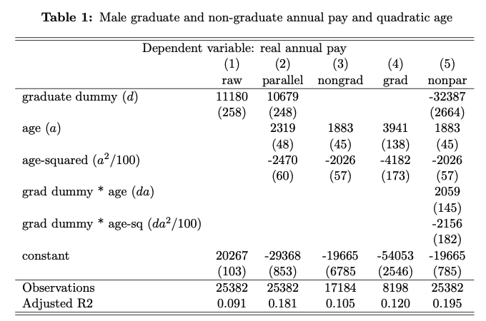

```{r setup, include = FALSE}
knitr::opts_chunk$set(echo = FALSE)

library(webexercises)
```
# The multiple regression model
## Basics


Consider the very first model in the endogeneity section, which has $K = 3$ RHS variables, also known as **covariates** or **regressors**.
(written out again, with $e$ becoming $u$.):

$$
y = \beta_0 + \beta_1 x_1 + \beta_2 x_2 + u.
$$ {#eq-lloris}

Why are there 3 variables?  Because there is an invisible variable
$x_0\equiv 1$ multiplying $\beta_0$.  It is known as \textbf{the constant}, because it
doesnt actually vary.

Assume we have a sample of data:
$$
\{(y_i, x_{1i}, x_{2i}): i=1,\dots,n \}.
$$
The question is, how do we estimate this model by OLS?  The only
difference is that in the endogeneity section we had only two variables,
whereas in general we have $K$ variables.  Our approach is identical to
before, just that $K$ is bigger.

The general principle is that we need as many assumptions like A1, A2,
A4 as there are parameters to estimate.  As $K=3$, these are
\begin{align}
\tag{A1}
E(u)     &= 0 \\
\tag{A2}
Cov(u, x_1) &= 0 \\
\tag{A3}
Cov(u, x_2) &= 0.
\end{align}

Next, we multiply @eq-lloris by 1, $x_1$ and $x_2$
respectively:
\begin{align*}
y     &= \beta_0     + \beta_1 x_1    + \beta_2 x_2    + u \\
y x_1 &= \beta_0 x_1 + \beta_1 x^2_1  + \beta_2 x_2x_1 + ux_1 \\
y x_2 &= \beta_0 x_2 + \beta_1 x_1x_2 + \beta_2 x^2_2  + ux_2
\end{align*}
and apply the expectation operator $E(.)$ throughout:
\begin{align*}
E(y    ) &= \beta_0         + \beta_1 E(x_1    ) + \beta_2 E(x_2    ) + E(u    ) \\
E(y x_1) &= \beta_0 E(x_1) + \beta_1 E(x^2_1  ) + \beta_2 E(x_2 x_1) + E(u x_1) \\
E(y x_2) &= \beta_0 E(x_2) + \beta_1 E(x_1 x_2) + \beta_2 E(x^2_2  ) + E(u x_2).
\end{align*}


Next, we impose A1, A2, A3 above (Remember, $Cov(u, x_k) = 0$
and $E(u x_k) = 0$ are the same thing):
$$
E(y    ) = \beta_0         + \beta_1 E(x_1    ) + \beta_2 E(x_2    ) + 0 
$$ {#eq-chinesedembele1}
$$
E(y x_1) = \beta_0 E(x_1) + \beta_1 E(x^2_1  ) + \beta_2 E(x_2 x_1) + 0 
$$ {#eq-chinesedembele2}
$$
E(y x_2) = \beta_0 E(x_2) + \beta_1 E(x_1 x_2) + \beta_2 E(x^2_2  ) + 0. 
$$ {#eq-chinesedembele3}

These are 3 equations for 3 unknown $\beta$s.  Assuming they can be
solved, they generate the \textbf{OLS estimators} $\hat{\beta_0}$
$\hat{\beta_1}$ and $\hat{\beta_2}$.  The estimators are said to be identified.

Next, we replace population means, variances, and covariances by their sample counterparts (the analogy principle).  Finally,
the system of equations is solved:
$$
\Sigma y_i        = \hat{\beta_0}               + \hat{\beta}_1 \Sigma x_{1i}        + \hat{\beta_2} \Sigma x_{2i}
$$ {#eq-ndembele1}

$$
\Sigma y_i x_{1i} = \hat{\beta_0} \Sigma x_{1i} + \hat{\beta}_1 \Sigma x^2_{1i}      + \hat{\beta_2} \Sigma x_{2i} x_{1i}
$$ {#eq-ndembele2}

$$
\Sigma y_i x_{2i} = \hat{\beta_0} \Sigma x_{2i} + \hat{\beta}_1 \Sigma x_{1i} x_{2i} + \hat{\beta_2} \Sigma x^2_{2i}.
$$ {#eq-ndembele3}

As the computer knows what to do, there is no need to write down the solution in a course like Econ20222.This happens in more
technical courses. Similarly, the computer knows what to do when calculating the robust standard errors for $\hat{\beta_0}$ $\hat{\beta_1}$ and $\hat{\beta_2}$.  This is essentially what OLS in a multiple regression context is.


There are situations when the computer will not be able to solve the system of 
@eq-ndembele1, @eq-ndembele2,and @eq-ndembele3. They are:

1. When any of the $x_{ki}$ do not have any variation in the sample:
   
   $$
   \widehat{Var(x_{ki})} = 0.
   $$
   
   Recall that this was an issue in the $K = 2$ case.

2. When there is an exact linear combination between the $x_{ki}$’s:
   
   $$
   \lambda_1 x_{1i} + \lambda_2 x_{2i} = \lambda_0.
   $$
   
   This is known as **perfect multicollinearity**. It can happen a lot.  
   Examples:
   \begin{align}
\tag{R1}
   
   x_{1i} &= -\lambda_2 x_{2i} \quad (\lambda_1 = 1, \lambda_0 = 0).\\
   
   \tag{R2}
   
   x_{1i} + x_{2i} &= 1 \quad (\lambda_1 = \lambda_2 = \lambda_0 = 1).
   \end{align}
   
   What does the investigator then do? If (R1) is the problem, then either
   $x_{1i}$ or $x_{2i}$ has to be “dropped” from the model; there is no new information in $x_{1i}$ that is not already in $x_{2i}$. In general, one needs to impose the offending **restriction** on the
   model. So, for (R2), substitute into @eq-lloris and collect terms:
   
   $$
   y = (\beta_0 + \beta_2) + (\beta_1 - \beta_2) x_1 + u.
   $$
   
   One can see that $\beta_2$ is not identified and can be
   dropped, ignored, or set to zero. This is because $x_1$ and
   $x_2$ are the same as each other (via (R2)).


This multiple regression technique extends to $K>3$.  Again, the computer knows what to do.

\textbf{Example. What happens when $K=2$?}

@eq-chinesedembele1 , @eq-chinesedembele2  @eq-chinesedembele3 becomes:
\begin{align*}
E(y)     &= \beta_0         + \beta_1 E(x_1)   \\
E(y x_1) &= \beta_0 E(x_1) + \beta_1 E(x^2_1).
\end{align*}

Now, multiply the first equation by $E(x_1)$ and subtract from the
second:
\begin{align*}
E(y x_1) - E(y)E(x_1) &= \beta_1 \{E(x^2_1)-[E(x_1)]^2\} \quad \text{or}\\
Cov(y,x_1) &= \beta_1 Var(x_1),
\end{align*}
which takes us back to Equation $$ \beta = \frac{cov(y,x)}{var(x)}$$ in the introduction section.

In the rest of this section, we examine various uses for the multiple
regression model.

## More than two categories; firm-size and wages


It is well-known that larger firms pay higher wages than smaller firms.
This is actually true \emph{ceteris paribus} on many observable
variables (gender, education, industry, occupation, etc), but for the
moment let us think about the raw relationship between wages and
firm-size.

The data at hand ask employees to record their firm size, say $f_i^*$ (an
integer), into one of $K = 9$ **bins** (or **bands** or **buckets**)(The notation $x \in (a,b]$ is the same as $a < x \le b$):

$$
[1,2],\;[3,9],\;[10,24],\;[25,49],\;[50,99],\;[100,199],\;[200,499],\;[500,999],\;[1000,\infty].
$$

$f_i^*$ is unobserved to the econometrician (recall the endogeneity section on Measurement Error). With the information recorded in these bins, one can first create an \textbf{integer-valued ordered multi-categorical variable} $f_i$
that records the mid-point if each bin:
(Notes: The 1500 is arbitrary because the highest bin is open-ended. A more accurate way of writing $f_i$ is $f_{i(k)}$.
It says that the unit-of-observation is $i$ but the variable only varies by $k$. The table below illustrates.)
$$
1,6,17,37,75,50,350,750,1500.
$$

Also, this is similar to when we had a dummy variable for men in
the introduction section, except that now we have $K$ categories
rather than just 2 (men and women). This suggests we
"create" $K=9$ dummies variables, defined as follows:
\begin{align*}
x_{1i } &=
\begin{cases}
\text{1 if $1 \leq f^*_i \leq 2$} \\
\text{0 else}
\end{cases} \qquad \text{or} \qquad x_{1i}=1(1 \leq f^*_i \leq  2) \\
x_{2i} &=
\begin{cases}
\text{1 if $3 \leq f^*_i \leq 9$} \\
\text{0 else}
\end{cases} \qquad \text{or} \qquad x_{2i}=1(3 \leq f^*_i \leq 9) \\
\vdots \\
x_{9i} &=
\begin{cases}
\text{1 if $f^*_i  \geq 1000$} \\
\text{0 else}
\end{cases} \qquad \text{or} \qquad x_{9i}=1(f^*_i  \geq 1000     ).
\end{align*}

In general, $x = 1$("condition") means $x = 1$ if “condition” is
true and $x = 0$ if “condition” is false. It is a very neat notation
for defining a dummy variable.

The following table should help visualise the data:

| $i$       | $\log y_i$ | 1 | $x_{1i}$ | $x_{2i}$ | $\cdots$ | $x_{9i}$ | $f_i$ | $f_i^*$ |
|-----------|------------|---|----------|----------|----------|----------|--------|---------|
| 1         | 5.42       | 1 | 1        | 0        | $\cdots$ | 0        | 1      | 1       |
| 2         | 5.39       | 1 | 1        | 0        | $\cdots$ | 0        | 1      | 2       |
| 3         | 5.62       | 1 | 1        | 0        | $\cdots$ | 0        | 1      | 2       |
| $\vdots$  | $\vdots$   | $\vdots$ | $\vdots$ | $\vdots$ | $\cdots$ | $\vdots$ | $\vdots$ | $\vdots$ |
| $n_1$     | 4.36       | 1 | 1        | 0        | $\cdots$ | 0        | 1      | 1       |
|-----------|------------|---|----------|----------|----------|----------|--------|---------|
| $n_1+1$   | 4.29       | 1 | 0        | 1        | $\cdots$ | 0        | 6      | 3       |
| $n_1+2$   | 4.86       | 1 | 0        | 1        | $\cdots$ | 0        | 6      | 7       |
| $\vdots$  | $\vdots$   | $\vdots$ | $\vdots$ | $\vdots$ | $\cdots$ | $\vdots$ | $\vdots$ | $\vdots$ |
| $n_1+n_2$ | 4.86       | 1 | 0        | 1        | $\cdots$ | 0        | 6      | 8       |
|-----------|------------|---|----------|----------|----------|----------|--------|---------|
| [6categories] |  |  |  |  |  |  |  |  |
|-----------|------------|---|----------|----------|----------|----------|--------|---------|
| $\vdots$  | 3.42       | 1 | 0        | 0        | $\cdots$ | 1        | 1500   | 1324    |
| $\vdots$  | $\vdots$   | $\vdots$ | $\vdots$ | $\vdots$ | $\cdots$ | $\vdots$ | $\vdots$ | $\vdots$ |
| $n$       | 3.33       | 1 | 0        | 0        | $\cdots$ | 1        | 1000   | 7022    |
|-----------|------------|---|----------|----------|----------|----------|--------|---------|
| sum       | $\sum_{i=1}^n \log y_i$ | $n$ | $n_1$ | $n_2$ | $\cdots$ | $n_9$ |  |  |
| average   | $\overline{\log y}$    | 1   | $n_1/n$ | $n_2/n$ | $\cdots$ | $n_9/n$ |  |  |

To be clear, individual $n_1+2$ works in a firm who employs 6 other individuals.  The data only record that she works in a small firm:
between 3 and 9 workers.  Her log-pay is 4.86.

The sample regression we run is written:
$$
\log y_i = \beta_0 + \beta_1 x_{1i} + \beta_2 x_{2i} + \dots + \beta_9 x_{9i} + u_i.
$$
**However**, the computer will not be able to solve the equations,
because it is clear from the table that
$$
x_{1i} + x_{2i} + \dots + x_{9i} = 1 
\quad \text{for } \underline{\text{every}} \text{ individual } i.
$$
This example of \textbf{perfect multi-collinearity} is also known as the \textbf{dummy variable trap}.  We therefore drop a dummy, and actually choose the largest firm-size category, leading to a population
regression:
(*Notes:*If we dont drop a variable, the computer will decide for us. And it tends to make silly decisions!)
$$
\log y = \beta_1 x_{1} + \beta_2 x_{2} + \dots + \beta_8 x_{8} + \beta_0 + u.
$$ {#eq-fsize}

There are 9 moment conditions:
(*Note that these 9 moment conditions
imply $E(u)=0$.*)
\begin{align*}
E(u |x_1=1) &= 0  \\
             & \vdots \\
E(u |x_8=1) &= 0  \\
E(u |x_9=1) &= 0.
\end{align*}
Now take expectations of @eq-fsize, switching all 9 dummies
on/off:
\begin{align*}
E(\log y | x_1=1) &=      \beta_0+\beta_1+E(u |x_1=1)= \beta_0+\beta_1\\
                   &\vdots                                              \\
E(\log y | x_8=1) &=      \beta_0+\beta_8+E(u |x_8=1)= \beta_0+\beta_8\\
E(\log y | x_9=1) &=      \beta_0        +E(u |x_9=1)= \beta_0
\end{align*}
and so we solve, to get:
\begin{align*}
\beta_1  & = E(\log y | x_1=1)-E(\log y | x_9=1) \\
         &\vdots                                   \\
\beta_8  & = E(\log y | x_8=1)-E(\log y | x_9=1) \\
\beta_0  & = E(\log y | x_9=1).
\end{align*}
These can also be written:
\begin{align*}
\beta_1  & = E(\log y |1   \leq f^* \leq  2)-E(\log y |f^* \geq 1000)\\
         &\vdots                                  \\
\beta_8  & = E(\log y |500 \leq f^* \leq999)-E(\log y |f^* \geq 1000)\\
\beta_0  & = E(\log y |f^* \geq 1000       ).
\end{align*}


In words, $\beta_0$ is average log real hourly wage for the
**omitted or base** category (working for a firm employing 1000+
workers).  All the other $\beta_k$s are interpreted as the population raw differential in log real hourly wages between the firm-size category that $\beta_k$ "belongs to" and the largest firm-size category.  These are estimated by the corresponding raw differentials and are measured in log-points.


The fitted values from this regression are
$$
E (\log y | k=j) \quad j=1,\dots,9.
$$
In words, there are just 9 fitted values, depending on which firm-size
category the individual belongs to.  But typically with microeconometric data there are many thousands of datapoints.  So one
can think of regression as "collapsing" such micro-data to just 9 just data-points:
$$
\{(\overline{\log y}_k, f_k): \quad k=1,\dots,9 \}.
$$

The final issue whether this \textbf{non-parametric} relationship can be
modelled parametrically?  One might want to fit a log-log model:
$$
\log y_k = \delta_0 + \delta_1 \log f_k + \text{error}_k \qquad k=1,\dots,9.
$$
or a quadratic
$$
\log y_k = \delta_0 + \delta_1 f_k + \delta_2 f^2_k + \text{error}_k \qquad k=1,\dots,9.
$$
The relationship between log-pay and age is often modelled like this.
This is discussed next.


## Controlling for observables

The basic idea is that we add as many relevant variables as we can to a
model, to mitigate/minimise \underline{some} of the effect of omitted variables
bias (OVB).  OVB was discussed in the enogeneity section.  But we
emphasise that there is often something fundamentally unobserved.  If so, adding controls will not completely remove OVB.

Consider the multiple regression model:
$$
\begin{aligned}
y &= \beta_0 + \beta_1 x_1 + \beta_2 x_2 + \dots + \beta_K x_K + u \\
  &= \beta_0 + \beta_1 x_1 + \mathbf{x}'\mathbf{b} + u
\end{aligned}
$$
$\beta_1$ is the effect of interest. All the other variables are **controls**.
The second line introduces some useful notation:
$$
\mathbf{x}' = (x_2, \dots, x_K)  \quad
\mathbf{b}' = (\beta_2, \dots, \beta_K).
$$
If you uncomfortable with the idea of multiplying vectors,  just think
$\mathbf{x}'\mathbf{b}$ as short-hand which saves the clumisnes of writing out the
long list $\beta_2 x_2 + \dots + \beta_K x_K$.

Often $x_1$ is a dummy $d$ (sometimes a treatment or policy dummy).

::: {.callout-note}
### Example  Lifetime earnings and a university degree

Consider the model:
$$
y = \beta_0 + \tau d + \beta_1 a + \beta_2 a^2 + \mathbf{x}'\mathbf{b} + u
$$ {#eq-jack}
where $y$ is earnings, $d$ is a graduate dummy, and $a$ is age.

Our objective is to interpret the key parameters (assuming all the RHS variables are exogenous). We do the usual trick of switching $d$
on-and-off:
\begin{align*}
E(y | a,\mathbf{x}',d=1) &= \beta_0 + \tau    + \beta_1 a + \beta_2 a^2 + \mathbf{x}'\mathbf{b} \\
E(y | a,\mathbf{x}',d=0) &= \beta_0 \hspace{7.6mm} + \beta_1 a + \beta_2 a^2 + \mathbf{x}'\mathbf{b}.
\end{align*}
Subtracting provides an interpretation for the parameter $\tau$
associated with the graduate dummy (Notice the usefulness of
the $\mathbf{x}$ notation. Without it, we would have to write $E(y | a,x_2,
\dots, x_K,d=0)$.),
$$
\tau = E(y | a,\mathbf{x}',d=1)-E(y | a,\mathbf{x}',d=0),
$$
which is the so-called **conditional differential** (or
conditional treatment effect, if appropriate.)
This is contrasted with the **unconditional differential**
$$
E(y | d=1)-E(y | d=0),
$$ {#eq-levi}
which was first discussed in the introduction earlier.
The difference between the conditional and unconditional differential is the
presence of $\{a,a^2,\mathbf{x}'\}$ in Equation~@eq-jack.

The expression $E(y | a,\mathbf{x}',d)$ is a so-called **Conditional
Expectation Function** (CEF).  In this set-up there are actually two of
them, for graduates and non-graduates respectively.  Both CEFs depend on
$\{a,a^2,\mathbf{x}'\}$, whereas their difference, $\tau$, does not.  It is a
single number that captures the gap between average $y$ for both groups.
This is because everything comes from the same regression,
@eq-jack, and so everything nets out, especially $\beta_1 a +
\beta_2 a^2$.  In other words, the two CEFs are parallel when plotted in
the same picture: @fig-parallel_grads plots the estimated
relationship between (unlogged) annual pay and age for for graduates and
non-graduates, but for males only.(Note:One always models gender
separately.  Although the pattern for women is similar, not drawn,
retirement is at 60, not 65, and annual pay is much lower on average.)

::: center
{#fig-parallel_grads}
:::


In passing, when plotting the CEFs, what do we do about the term
$\mathbf{x}'\mathbf{b}$? When the model has been estimated, we have $\hat{\beta_k}$s,
but what do we do about the $x_i$s, which vary from observation to
observation? The answer is to use sample averages
$$
\mathbf{x}'\mathbf{\hat{b}} = \hat{\beta_2} \bar{x}_2 + \dots + \hat{\beta_K} \bar{x}_K.
$$
In the software, this can be pain.

The results are given in Table 1 (@fig-tblgrad_pay).  Column~(1) reports
the raw gradaute differential, whereas Column~(2) reports the estimated
from @eq-jack.  From the latter, one can see that $\hat{\tau}$ is
about £ 10.7k, which is can be converted into a lifetime figure by
multiplying £10.7k by 65-21=44 years.

::: center
{#fig-tblgrad_pay}
::: 

*Notes:*  
(a) Robust standard errors in parentheses.  
(b) Data are from the BHPS/US extract discussed elsewhere.  
(c) Column (5) reports estimates of Equation @eq-IFS.  
(d) Columns (3) and (4) are identical to Column (5), seen by switching the graduate dummy on and off.


But surely the next figure is even more realistic \dots?

::: center
{#fig-column5}

:::


Now the gap is no longer a constant, but actually a quadratic in age.
In other words, we need to make the age-relationship vary by $d$.  To do
this, we add two \textbf{interaction terms}, $da$ and $da^2$, to the
model:
$$
y = \beta_0 + \beta_1 a + \beta_2 a^2 + \tau_0 d + \tau_1 da
+ \tau_2 da^2 + \mathbf{x}'\mathbf{b} + u.
$$ {#eq-IFS}
This is basic estimating equation used in a recent IFS Working
Paper.(See [IFS publication 13731](https://www.ifs.org.uk/publications/13731).)


Reworking the CEFs:
\begin{align*}
E(y | a,\mathbf{x}',d=1) &= \beta_0  + \beta_1 a + \beta_2 a^2 +     \tau_0 + \tau_1 a + \tau_2 a^2  + \mathbf{x}'\mathbf{b}\\
E(y | a,\mathbf{x}',d=0) &= \beta_0  + \beta_1 a + \beta_2 a^2 \hspace{32mm}                         + \mathbf{x}'\mathbf{b}
\end{align*}
and so the conditional graduate earnings differential is 
$$
E(y | a,\mathbf{x}',d=1)-E(y | a,\mathbf{x}',d=0) = \tau_0 + \tau_1 a + \tau_2
a^2.
$$
This can be computed at any age. The IFS do this at $a=29$. Using our
data, not theirs, we can see that this about £ 7.2k. See the red
vertical line in the figure.

One can also use the estimates from @eq-IFS to compute a
lifetime conditional graduate earnings differential:
$$
\int_{a=18}^{65} (\tau_0 + \tau_1 a + \tau_2 a^2 )da =
\left[\tau_0 a + \frac{\tau_1}{2} a^2 + \frac{\tau_2}{3} a^3\right]_{18}^{65}.
$$
Using the BHPS/US, this turns out about £ 467k.  This ball-park
figure was used a lot by policy makers at the time graduate fees were
increased to £ 3,200 in 2006.
:::

## Long and short regressions


To summarise the previous subsection, when estimating
$$
y = \beta_0 + \beta_1 d + \mathbf{x}'\mathbf{b} + u
$$
the conditional differential is
$$
E(y | \mathbf{x}',d=1)-E(y | \mathbf{x}',d=0),
$$
whereas when estimating
$$
y = \beta_0 + \beta_1 d + u
$$
the conditional differential is
$$
E(y | d=1)-E(y | d=0).
$$
Whilst conceptually different, as explained, do the OLS estimates actually differ from each other? And if they do, when? And in which
direction?


[Angrist & Pischke (2015)](#para-angrist_pischke) use the long/short terminology. Define $\hat{\beta}_1$
as the OLS estimate from the long regression and $\tilde{\beta}_1$ as the
OLS estimate from the short regression. When the long regression
contains one extra covariate, we compare the estimates from:
\begin{align*}
\tag{L}
y &= \beta_0 + \beta_1 x_1 + \beta_2 x_2 + e \\
\tag{S}
y &= \beta_0 + \beta_1 x_1 + u,
\end{align*}
with $Cov(e,x_1)= Cov(e,x_2)=E(e)=0$.
When estimating (S), the OVB formula $$\text{Bias}(\hat{\beta_1}) \equiv E(\hat{\beta_1}) - \beta_1 =
\beta_2  \frac{Cov(x_2,x_1)}{Var(x_1)}= \beta_2 \delta_1 $$ in the endogeneity section says:

$$
\text{Bias}(\tilde{\beta_1}) \equiv E(\tilde{\beta_1}) - \beta_1 =
\beta_2  \frac{Cov(x_2,x_1)}{Var(x_1)}= \beta_2 \delta_1,
$$ {#eq-fernando}

where $\delta_1$ is the "slope" parameter in population model that
relates $x_1$ and $x_2$:
$$
x_2 = \delta_0 + \delta_1 x_1 + \text{error}.
$$
On the other hand, when estimating (L), the OVB formula says the bias is zero:
$$
\text{Bias}(\hat{\beta_1}) \equiv E(\hat{\beta_1}) - \beta_1 =0.
$$ {#eq-hat}


Subtracting @eq-hat from @eq-fernando, we end up with
$$
E(\tilde{\beta_1}) - E(\hat{\beta_1}) =  \beta_2 \delta_1.
$$
It turns out that this holds \underline{exactly} in the data:(*Note:*You do
not need to know the actual details; see the Appendix to this section.)
$$
\tilde{\beta_1} - \hat{\beta_1} =  \hat{\beta_2} \hat{\delta}_1.
$$ {#eq-southgate}
When the long regression is longer than 2 covariates
$$
\tag{L}
y = \beta_0 + \beta_1 x_1 + \beta_2 x_2 + \dots + \beta_K x_K + e,
$$
the formula @eq-southgate doesn't hold exactly, but it still works in principle.

The formula is very useful in many situations. Two examples were given
in the lectures.


To conclude, the argument is that a correctly specified model completely removes
OVB, provided the usual exogeneity assumption(s) hold. It is worth restating
exactly what “unbiased” actually means. To quote Wooldridge(2013, pages 87/88):

> Since we are approaching the point where we can use multiple regression
> in serious empirical work, it is useful to remember the meaning of
> unbiasedness. It is tempting, in examples such as the wage equation in
> (3.19), to say something like “9.2% is an unbiased estimate of the
> return to education.” As we know, an estimate cannot be unbiased: an
> estimate is a fixed number, obtained from a particular sample, which
> usually is not equal to the population parameter. When we say that OLS
> is unbiased under Assumptions MLR.1 through MLR.4 (see footnote[^1]), we
> mean that the procedure by which the OLS estimates are obtained is
> unbiased when we view the procedure as being applied across all possible
> random samples. We hope that we have obtained a sample that gives us an
> estimate close to the population value, but, unfortunately, this cannot
> be assured. What is assured is that we have no reason to believe our
> estimate is more likely to be too big or more likely to be too small.

[^1]: Wooldridge’s Assumptions MLR.1 through MLR.4 essentially correspond to the
two assumptions we make in the introduction section.

This is essentially the same as the quotation in Angrist and Pischke (2015)  on
Page 5.


# Appendix
showing that @eq-southgate holds

When estimated by OLS, the long and short regressions are written:

$$
\begin{aligned}
\text{(L)} \qquad 
y &= \hat{\beta}_0 + \hat{\beta}_1 x_1 + \hat{\beta}_2 x_2 + \hat{u}, \\
\text{(S)} \qquad 
y &= \tilde{\beta}_0 + \tilde{\beta}_1 x_1 + \tilde{u}.
\end{aligned}
$$

The OLS estimator of $\beta_1$ from the short regression is

$$
\tilde{\beta}_1 = \frac{\widehat{Cov}(x_1, y)}{\widehat{Var}(x_1)} .
$$

Substituting in from the long regression:

$$
\begin{aligned}
\tilde{\beta}_1
&= \frac{\widehat{Cov}\!\left(x_1, 
\hat{\beta}_0 + \hat{\beta}_1 x_1 + \hat{\beta}_2 x_2 + \hat{u}\right)}
{\widehat{Var}(x_1)} \\[6pt]
&= \frac{0 
+ \hat{\beta}_1 \widehat{Cov}(x_1, x_1) 
+ \hat{\beta}_2 \widehat{Cov}(x_1, x_2) 
+ \widehat{Cov}(x_1, \hat{u})}
{\widehat{Var}(x_1)} .
\end{aligned}
$$

Remembering that OLS is defined by imposing $\widehat{Cov}(x_1, \hat{u}) = 0$:

$$
\tilde{\beta}_1 
= \hat{\beta}_1 
+ \hat{\beta}_2 \frac{\widehat{Cov}(x_1, x_2)}{\widehat{Var}(x_1)}
= \hat{\beta}_1 + \hat{\beta}_2 \hat{\delta}_1 ,
$$

where $\hat{\delta}_1$ comes from regressing $x_2$ on $x_1$:

$$
\text{(qed)} \qquad 
\hat{x}_2 = \hat{\delta}_0 + \hat{\delta}_1 x_1 .
$$


# Reading

This section is based on both Angrist & Pischke (2015, chapter 2) and Wooldridge
(2018, chapter 3).

Angrist, J. & Pischke, J.-S. (2015), Mastering ’Metrics: The Path From Cause To
Effect, Princeton University Press, Princeton, NJ.

#################################


My name is Yidi

This is a Web Exercise template created by the [#PsyTeachR team at the University of Glasgow](https://psyteachr.github.io), based on ideas from [Software Carpentry](https://software-carpentry.org/lessons/). This template shows how instructors can easily create interactive web documents that students can use in self-guided learning.

My name is Ralf

The `{webexercises}` package provides a number of functions that you use in [inline R code](https://github.com/rstudio/cheatsheets/raw/main/rmarkdown.pdf) or through code chunk options to create HTML widgets (text boxes, pull down menus, buttons that reveal hidden content). Examples are given below. Render this file to HTML to see how it works.

**NOTE: To use the widgets in the compiled HTML file, you need to have a JavaScript-enabled browser.**

## Example Questions

### Fill-In-The-Blanks (`fitb()`)

Create fill-in-the-blank questions using `fitb()`, providing the answer as the first argument.

- 2 + 2 is `r fitb(4)`

You can also create these questions dynamically, using variables from your R session.

```{r}
x <- sample(2:8, 1)
```

- The square root of `r x^2` is: `r fitb(x)`

The blanks are case-sensitive; if you don't care about case, use the argument `ignore_case = TRUE`.

- What is the letter after D? `r fitb("E", ignore_case = TRUE)`

If you want to ignore differences in whitespace use, use the argument `ignore_ws = TRUE` (which is the default) and include spaces in your answer anywhere they could be acceptable.

- How do you load the tidyverse package? `r fitb(c("library( tidyverse )", "library( \"tidyverse\" )", "library( 'tidyverse' )"), ignore_ws = TRUE, width = "20")`

You can set more than one possible correct answer by setting the answers as a vector.

- Type a vowel: `r fitb(c("A", "E", "I", "O" , "U"), ignore_case = TRUE)`

You can use regular expressions to test answers against more complex rules.

- Type any 3 letters: `r fitb("^[a-zA-Z]{3}$", width = 3, regex = TRUE)`

### Multiple Choice (`mcq()`)

- "Never gonna give you up, never gonna: `r mcq(c("let you go", "turn you down", "run away", answer = "let you down"))`"
- "I `r mcq(c(answer = "bless the rains", "guess it rains", "sense the rain"))` down in Africa" -Toto

### True or False (`torf()`)

- True or False? You can permute values in a vector using `sample()`. `r torf(TRUE)`

### Longer MCQs (`longmcq()`)

When your answers are very long, sometimes a drop-down select box gets formatted oddly. You can use `longmcq()` to deal with this. Since the answers are long, It's probably best to set up the options inside an R chunk with `echo=FALSE`. 

**What is a p-value?**

```{r}
opts_p <- c(
   "the probability that the null hypothesis is true",
   answer = "the probability of the observed, or more extreme, data, under the assumption that the null-hypothesis is true",
   "the probability of making an error in your conclusion"
)
```

`r longmcq(opts_p)`

**What is true about a 95% confidence interval of the mean?**

```{r}
# use sample() to randomise the order
opts_ci <- sample(c(
  answer = "if you repeated the process many times, 95% of intervals calculated in this way contain the true mean",
  "there is a 95% probability that the true mean lies within this range",
  "95% of the data fall within this range"
))
```

`r longmcq(opts_ci)`

## Checked sections

Create sections with the class `webex-check` to add a button that hides feedback until it is pressed. Add the class `webex-box` to draw a box around the section (or use your own styles).

::: {.webex-check .webex-box}

I am going to learn a lot: `r torf(TRUE)`

```{r, results='asis'}
opts <- c(
   "the probability that the null hypothesis is true",
   answer = "the probability of the observed, or more extreme, data, under the assumption that the null-hypothesis is true",
   "the probability of making an error in your conclusion"
)

cat("What is a p-value?", longmcq(opts))
```

:::


## Hidden solutions and hints

You can fence off a solution area that will be hidden behind a button using `hide()` before the solution and `unhide()` after, each as inline R code.  Pass the text you want to appear on the button to the `hide()` function.

If the solution is a code chunk, instead of using `hide()` and `unhide()`, simply set the `webex.hide` chunk option to TRUE, or set it to the string you wish to display on the button.

**Recreate the scatterplot below, using the built-in `cars` dataset.**

```{r}
with(cars, plot(speed, dist))
```


`r hide("I need a hint")`

See the documentation for `plot()` (`?plot`)

`r unhide()`

<!-- note: you could also just set webex.hide to TRUE -->

```{r, echo = TRUE, eval = FALSE}
#| webex.hide: "Click here to see the solution"
plot(cars$speed, cars$dist)
```
